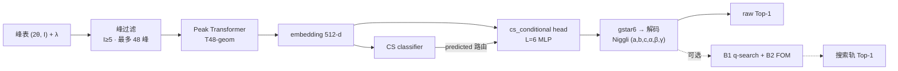
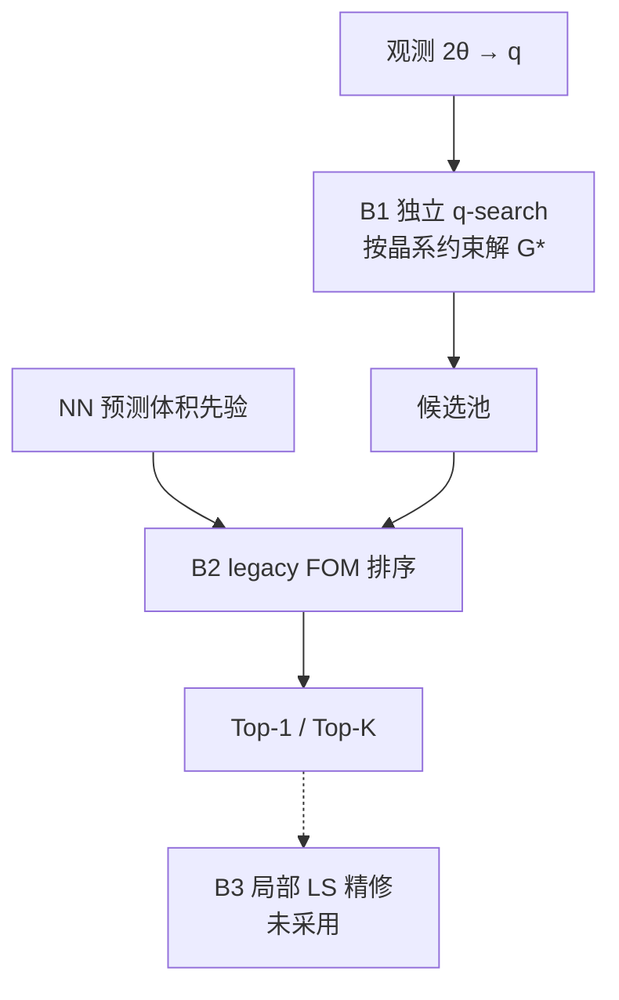

# PXRD Cell Indexer

从粉末 XRD **峰表**预测 **Niggli 原胞** `(a, b, c, α, β, γ)`（及后验晶系）的神经 cell indexing。

```text
(2θ, I) peaks + λ  →  Peak Transformer + gstar6 head  →  可选 q-search / FOM  →  Top-1 cell
```

本仓库只做 **indexing**（定胞），不做全结构生成（RealPXRD Without-L）。

---

## 1. 最新进展（2026-07-22）

### 1.1 双轨基线（已锁定）

| 轨道 | 配置 / 流水线 | valid1400 strict | MP100 strict |
|------|----------------|------------------|--------------|
| **模型** | A3-G1：`T48-geom` + `cs_conditional` L=6 + **`gstar6`** | **~43.1%**（三 seed mean） | **23%**（raw） |
| **搜索** | B1 独立 q-search + B2 legacy FOM（+ NN `ref_volume`） | 高对称 pool Top-20 **64.4%**（vs NN 53.8%） | **36%** pred-CS / **42%** oracle-CS |

- 严格口径一律：`ltol=0.05`、`atol=3°`，标签为 Niggli 原胞。
- 北极星：MP100 对标 JADE ~68% / McMaille ~66%（当前缺口约 26–32pp）。
- **生产 checkpoint 仍用 A3-G1**；A4 鲁棒微调、A5 soft_strict、B3 局部精修均未替换生产模型。
- **尚未启动 S4 / 600 万全量**（中低对称 valid 搜索 Gate 未过）。

### 1.2 阶段状态一览

| 阶段 | 结果 | 一句话 |
|------|:----:|--------|
| Phase A（A0→A3） | ✓ | Peak Transformer + cs_cond + gstar6 → ~43% |
| S0 诊断 | ✓ | 邻域搜索仅 +3pp；MP100 掉到 23%；瓶颈=合取精度 + sim→real |
| S1 A5 soft_strict | ✗ | P0 最高 56% &lt; 95% Gate，淘汰 |
| S3 A4 鲁棒课程 | △ | 合成 V-mixed +6.7pp；MP100 +0.7pp 无实质收益 |
| S2-B1 高对称 q-search | ✓ | synthetic 100%；valid Top-20 +10.6pp vs NN |
| S2-B2 排序 | ✓ | legacy FOM+体积先验 → ranked Top-1 57.5% |
| S2-B3 精修 | ✗ | 无噪声数据无残差，不采用 |
| S2 顺序求解（中低对称） | △ | synthetic ortho/mono/tric ≥95%；**valid ortho/mono FAIL（15% &lt; NN 19%）** |

当前主线卡点：中低对称上 **CS 标签 ≠ Niggli 几何** + **轴向消光** → 顺序求解空池。详见 [`docs/实验记录/20260722-顺序求解与trigonal修复.md`](docs/实验记录/20260722-顺序求解与trigonal修复.md)。

执行方案（权威）：[`docs/开发日志/20260720-CellIndexing-后续优化方案v4.md`](docs/开发日志/20260720-CellIndexing-后续优化方案v4.md)。

---

## 2. 问题定义与指标

| | |
|---|---|
| **输入** | 变长峰表 `(2θ, I)` + 波长 `λ`（默认 Cu Kα 1.54184 Å） |
| **输出** | Niggli 原胞六参数；可选晶系分类 / Bravais 池 / FOM |
| **推理契约** | **peaks-only**：无 formula、无真实 CS/SG |
| **主 KPI（研发）** | valid1400 **strict raw Top-1 elementwise** |
| **北极星（产品）** | MP100 strict（同公差） |
| **松口径（诊断）** | `ltol=0.3` / `atol=10°`（loose ≈78%，说明「进对盆地」大体已解决） |

训练数据：外部 LMDB `pxrd_241113_{train,valid}.lmdb`（约 600 万量级）；常用子集 3.5k / 10k / **100k**（决策以 100k 为准）。

---

## 3. 模型设计（生产栈 A3-G1）

### 3.1 总览



配置：`configs/scale_100k_a3_g1_gstar6.yaml`（seed43/44 副本同结构）。

### 3.2 Encoder：Peak Transformer（`T48-geom`）

| 项 | 设定 |
|----|------|
| 类型 | `encoder_type: peak_transformer` |
| 峰数 | `max_peaks=48`，按 2θ 排序，不足 pad |
| Token | **geom**：强度 + Fourier 位置编码于 `g = 1/d²`（由 2θ、λ 换算） |
| 规模 | `d_model=256`，4 层，8 head，FFN 1024 |
| 池化 | `cls_mean` → 投影到 `embedding_dim=512` |

相对 hist-MLP 的优势：保留峰序与 reciprocal 几何，而不是固定 bin 的 bag-of-features。A2 扫参后锁定 `T48-geom`（相对更深 hist / fusion / rel-attn 等）。

### 3.3 Head：`cs_conditional`

- 7 类晶系分类器 + **按预测晶系路由**的条件化回归头（训练可用 oracle CS）。
- `head_num_layers=6`，hidden 512。
- 已否定方向（不再回归）：MCL 多假设、shared head、盲目加峰、peak⊕hist fusion 加深等（见 v3/A2.5 实验记录）。

### 3.4 输出表示：`gstar6`

回归目标不是直接 `(a,b,c,α,β,γ)`，而是倒易度量张量的 6 分量（对称 \(G^*\)），再解码为实空间胞参数：

\[
q_{hkl} = \mathbf{h}^\top G^* \mathbf{h},\quad
G^* = (M M^\top)^{-1}
\]

| 表示 | valid1400 strict | 决策 |
|------|------------------|------|
| matrix6（A2-ctrl） | ~40.6% | 基线 |
| **gstar6（A3-G1）** | **~43.1%** | **生产默认** |
| gstar6 + decoded-cell 辅助 loss（G2） | 未过 Gate | 淘汰 |

实现：`geometry.py`、`GStar6Normalizer`、`data/processed/lattice_gstar6_stats_*_niggli_seed42.json`。

### 3.5 分晶系表现（A3-G1 strict，约数）

| cubic | hex | trig | tet | ortho | mono | tric |
|:-----:|:---:|:----:|:---:|:-----:|:----:|:----:|
| ~95% | ~57% | ~53% | ~50% | ~22% | ~18% | ~5% |

低对称差，可用「合取」解释：strict ≈ \(p^k\)（\(k\)=自由度数）。架构主要抬底数 \(p\)，抬不动指数 \(k\)——这是后续转向 **propose-and-verify（搜索）** 的理论依据。

---

## 4. 搜索流水线（S2：B1 → B2 → B3）

在模型 raw 预测之外，独立从峰的 \(q=1/d^2\) 枚举/求解候选胞，再用物理 FOM 排序。



### 4.1 B1 独立 q-search

代码：`src/pxrd_cell_indexing/search/qsearch.py`。

| 晶系 | 策略 | Synthetic recall@5 | valid1400 备注 |
|------|------|-------------------|----------------|
| cubic | `cubic_p/f/i` 三变体（Niggli 下 F/I 非 90°） | 100% | 修复后 ~95% |
| tet / hex | 稠密/稀疏 hkl 枚举 + 向量化匹配 | 100% | 高对称 Gate 通过 |
| trigonal | `trigonal_hex` + `trigonal_rhomb` | 100% | 个体曾弱，变体后合成过 |
| ortho / mono | **顺序求解**：轴向解对角 → zone 解非对角 | ≥95% | **B1-S2 FAIL**（空池） |
| triclinic | 顺序求解 + pass-1 轴三元组 + beam 非对角 | ≥95%（单独跑 100%） | valid 未进 |

高对称 Gate（B1-S1）：oracle CS 路由下，q-search Top-20 **64.4%** vs NN 邻域 **53.8%**（+10.6pp）。

### 4.2 B2 排序

固定 B1 池对比多种 ranker：**legacy FOM + NN `ref_volume`** 最优（ranked Top-1 **57.5%**，efficiency 89%）。无需 learned reranker。

### 4.3 B3 精修

迭代局部精修 Gate 未过（+0.6pp，角度 MAE 不变）——无噪声模拟谱无残差可收。代码保留，生产不用。

### 4.4 中低对称 valid 失败诊断（B1-S2）

ortho+mono（n=40/系）：q-search Top-20 **15%** &lt; NN **19%**。

1. **空池为主**（探样 13/15），不是排序问题。  
2. **标签 CS ≠ Niggli 几何**（约 58% 样本）：心型/设定在 Niggli 下变成斜角，却用 90° 约束搜索。  
3. **轴向消光**：顺序求解依赖 (h00)/(0k0)/(00l)，真实峰列常缺轴向峰。

下一步方向：ortho/mono 心型→Niggli 变体；非轴向对角估计。

---

## 5. 优化流程（怎么走到今天）

### 5.1 决策树（浓缩）

```text
Phase A 表示/编码器
  A0 评测口径锁定（strict elementwise）
  A1 hist MLP 加深 → ~27%（触顶）
  A2 Peak Transformer T48-geom → ~33% → + cs_cond → ~40.6%
  A2.5 否定 MCL / shared / rel-attn / 盲目加峰
  A3 gstar6 → ~43.1%  ✓ 锁定生产 A3-G1
        │
        ▼
v4 诊断后分支
  S0  三探针：邻域+3pp耗尽；MP100 23%；合取解释分晶系
  S1  soft_strict loss ✗
  S3  A4 扰动课程 △（合成过、MP100 无收益）→ 仍用 A3-G1
  S2  独立 q-search ★ 主线天花板
        B1-S0/S1 高对称 ✓ → B2 ✓ → B3 ✗
        顺序求解 synthetic ✓ → B1-S2 valid 中低对称 ✗（进行中）
  S4  放量（算法冻结后；尚未开始）
```

### 5.2 理论主线（为何搜搜索）

- **strict 是合取**：低对称 \(k\) 大 → \(p^k\) 指数吃精度。  
- **loose − strict ≈ 35pp**：识别大体完成，缺的是精度与验证。  
- **抬 \(p\)（架构/loss）边际递减**；**propose-and-verify（多候选 + 物理打分）** 上限接近 loose。  
- **sim→real**：valid→MP100 掉 ~20pp；合成扰动课补不齐，需真实误差或更强搜索。

### 5.3 Gate 纪律

- 探路 seed42；过 Gate 再跑 43/44。  
- 架构/表示/loss 以 **100k** 决策；P0-700 只淘汰「完全不收敛」。  
- 模型改动看 valid1400 strict；搜索改动看 pool recall → ranked Top-1 → MP100。  
- 不对失败方向「多 seed 刷最好值」。

### 5.4 已关闭方向（勿再开）

hist 盲目加深、peak⊕hist fusion、MCL、shared head、rel-attn、decoded-cell(G2)、soft_strict(A5)、用合成扰动替换生产 ckpt、无噪声数据上的 B3 精修、未过中低对称 valid 前的 600 万放量。

---

## 6. 仓库结构

```text
pxrd-cell-indexer/
├── README.md / AGENT.md
├── configs/                 # smoke · 3500 · 100k · A2.5/A3/A4/A5 · 多 seed
├── docs/
│   ├── 00-requirements.md … 04-progress.md
│   ├── 开发日志/            # 方案 v3/v4、周报、决策
│   ├── 实验记录/            # 单次实验完整结果
│   └── references/          # 论文摘要（大文件 gitignore）
├── src/pxrd_cell_indexing/
│   ├── data/                # LMDB · Niggli · gstar6 · robust_perturb
│   ├── model/               # Peak Transformer · heads · FOM
│   ├── search/              # qsearch · rank · refine
│   ├── training/            # config · trainer · checkpoint
│   ├── geometry.py · losses.py · eval.py
├── scripts/                 # train · eval · B1/B2/B3 · robust · diagnose
├── tests/
├── data/MP-100samples-benchmark/
└── results/                 # gitignore：ckpt 与跑分 JSON
```

---

## 7. Quick start

### 安装

```bash
pip install -e ".[dev]"
make test
```

### 训练（生产配置）

```bash
python scripts/train.py --config configs/scale_100k_a3_g1_gstar6.yaml
```

### 评测

```bash
# valid1400 raw / strict
python scripts/eval_valid.py \
  --config configs/scale_100k_a3_g1_gstar6.yaml \
  --checkpoint results/experiments/scale_100k_a3_g1_gstar6_seed42/checkpoints/best.pt

# MP100
python scripts/eval_mp100.py \
  --checkpoint results/experiments/scale_100k_a3_g1_gstar6_seed42/checkpoints/best.pt
```

### 搜索流水线（示例）

```bash
# B1-S0：理想峰 synthetic Gate
python scripts/run_b1_s0_synthetic.py --systems cubic,tetragonal,hexagonal,trigonal --n-samples 20

# B1-S1 / B1-S2：valid1400 pool recall vs NN
python scripts/run_b1_s1_valid1400.py \
  --config configs/scale_100k_a3_g1_gstar6.yaml \
  --checkpoint results/experiments/scale_100k_a3_g1_gstar6_seed42/checkpoints/best.pt \
  --systems cubic,tetragonal,hexagonal,trigonal --n-per-system 40 --device cuda

# B1+B2 → MP100
python scripts/run_b1b2_mp100.py \
  --config configs/scale_100k_a3_g1_gstar6.yaml \
  --checkpoint results/experiments/scale_100k_a3_g1_gstar6_seed42/checkpoints/best.pt
```

引用数字时务必标明 **strict / loose** 与 **raw / 搜索轨**。

---

## 8. 外部依赖（不进库）

| 资源 | 说明 |
|------|------|
| 训练 LMDB | `alex_aflow_oqmd_mp/datasets/pxrd_241113_{train,valid}.lmdb` |
| 子集 jsonl | `data/processed/*_niggli_seed42.jsonl`（gitignore） |
| Checkpoint | `results/experiments/**/checkpoints/best.pt`（gitignore） |

小体积 `lattice_gstar6_stats_*.json` 已跟踪。详见 [`data/README.md`](data/README.md)。

---

## 9. 文档索引

| 文档 | 内容 |
|------|------|
| [`docs/开发日志/20260720-CellIndexing-后续优化方案v4.md`](docs/开发日志/20260720-CellIndexing-后续优化方案v4.md) | **当前执行方案**（决策树、Gate、看板） |
| [`docs/开发日志/20260715-CellIndexing-可执行优化方案v3.md`](docs/开发日志/20260715-CellIndexing-可执行优化方案v3.md) | Phase A 完成版方案 |
| [`docs/实验记录/20260717-A3-gstar6输出表示.md`](docs/实验记录/20260717-A3-gstar6输出表示.md) | gstar6 锁定 |
| [`docs/实验记录/20260721-B1-S1-valid1400高对称验证.md`](docs/实验记录/20260721-B1-S1-valid1400高对称验证.md) | 高对称搜索 Gate |
| [`docs/实验记录/20260721-B1B2-MP100基线复评.md`](docs/实验记录/20260721-B1B2-MP100基线复评.md) | 双轨 MP100 36%/42% |
| [`docs/实验记录/20260722-顺序求解与trigonal修复.md`](docs/实验记录/20260722-顺序求解与trigonal修复.md) | 顺序求解 + B1-S2 诊断 |
| [`docs/开发日志/起点.md`](docs/开发日志/起点.md) | 历史背景 vs Mc/JADE |
| [`docs/00-requirements.md`](docs/00-requirements.md) · [`01-design.md`](docs/01-design.md) | 需求与早期设计 |
| [`AGENT.md`](AGENT.md) | Agent 协作约定 |

---

## License

TBD.
