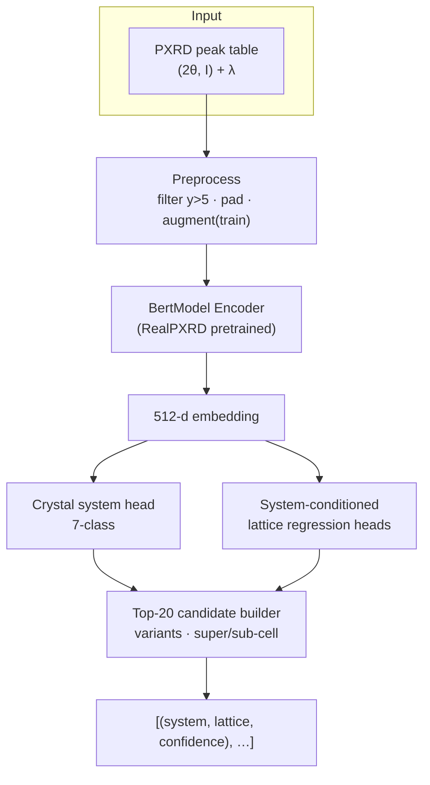
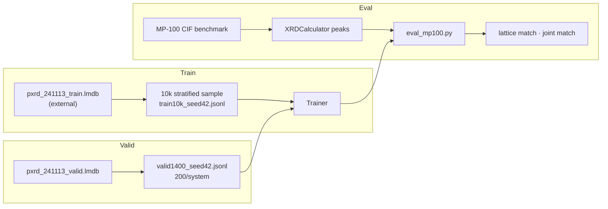

# PXRD Cell Indexer

> Neural **cell indexing** from powder X-ray diffraction (PXRD) peak lists: predict **crystal system** and **primitive lattice** parameters as Top-K candidates.

Train a model on `alex_aflow_oqmd_mp` LMDB data, evaluate on the **MP100** benchmark (100 stratified CIFs), and compare against traditional engines (McMaille ~76%, JADE9 ~73% on ideal peaks).

---

## What it does

| | |
|---|---|
| **Input** | Variable-length PXRD peak table `(2θ, I)` + wavelength `λ` |
| **Output** | Top-20 candidates: crystal system + primitive `(a,b,c,α,β,γ)` + confidence |
| **Training** | `pxrd_241113_train.lmdb` (~6M samples, external path) |
| **Benchmark** | `data/MP-100samples-benchmark/` (100 CIF, in-repo) |
| **Baselines** | McMaille / JADE9 lattice match (ltol=0.3, atol=10°) |

This is **cell indexing only** — not full-structure generation (RealPXRD Without L).

---

## Architecture



## Data flow



---

## Project layout

```
pxrd-cell-indexer/
├── README.md / AGENT.md       # navigation & collaboration contract
├── configs/                   # experiment yaml configs
├── docs/
│   ├── 00-requirements.md     # requirements
│   ├── 01-design.md           # architecture & decisions
│   ├── 04-progress.md         # milestone log
│   ├── 开发日志/              # work log (design, decisions, weekly)
│   └── 实验记录/              # per-experiment settings & analysis
├── src/pxrd_cell_indexing/    # core package
│   ├── data/                  # dataset · mp100 · normalization
│   ├── model/                 # encoder · heads · topk
│   ├── training/              # config · trainer · checkpoint
│   ├── losses.py · eval.py
├── scripts/                   # train · eval · diagnose
├── tests/
├── data/
│   ├── MP-100samples-benchmark/   # 100 CIF (tracked)
│   └── processed/                 # jsonl ignored; stats json tracked
└── results/                   # checkpoints & metrics (gitignored)
```

---

## Quick start

### Install

```bash
pip install -e ".[dev]"
```

### Verify

```bash
make test          # ruff + mypy + pytest
```

### Train (10k smoke)

```bash
python scripts/train.py --config configs/smoke_unfrozen.yaml
```

### Evaluate

```bash
python scripts/eval_valid.py --checkpoint results/experiments/<run>/checkpoints/best.pt
python scripts/eval_mp100.py --checkpoint results/experiments/<run>/checkpoints/best.pt
```

---

## External dependencies (not in repo)

| Resource | Path / note |
|---|---|
| Training LMDB | `alex_aflow_oqmd_mp/datasets/pxrd_241113_{train,valid}.lmdb` |
| Pretrained encoder | `pretrained/weight/2501/pxrd-all/last_one.ckpt` (~145 MB) |
| Processed splits | `data/processed/train10k_seed42.jsonl`, `valid1400_seed42.jsonl` (regenerate via `scripts/`) |

See [`data/README.md`](data/README.md) for data conventions.

---

## Current status

| Milestone | Status |
|---|---|
| M1 Data + model design | ✅ |
| M1.3–M1.9 Encoder / heads / train / eval pipeline | ✅ |
| M2 10k smoke & tuning | 🟡 valid Top-1 lattice match **35.4%** |
| M3 MP100 benchmark | 🟡 smoke weights Top-1 **47%** (plumbing verified) |

Latest detail: [`docs/04-progress.md`](docs/04-progress.md)

---

## Documentation

| Doc | Content |
|---|---|
| [`docs/00-requirements.md`](docs/00-requirements.md) | Goals, I/O, acceptance criteria |
| [`docs/01-design.md`](docs/01-design.md) | Architecture, modules, PM decisions |
| [`docs/开发日志/起点.md`](docs/开发日志/起点.md) | Cell Indexing history & benchmark context |
| [`AGENT.md`](AGENT.md) | Collaboration rules for this project |

---

## License

TBD.
