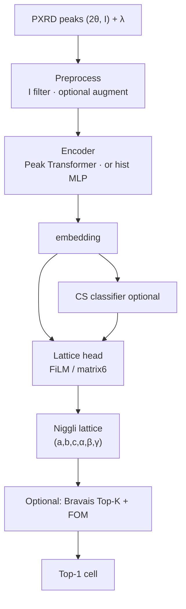

# PXRD Cell Indexer

Neural **cell indexing** from powder XRD peak lists: predict a **primitive / Niggli lattice** `(a,b,c,α,β,γ)` (and post-hoc crystal system) from peaks-only input.

```text
(2θ, I) peaks + λ  →  encoder  →  lattice head  →  Top-K / FOM (optional)  →  Top-1 cell
```

This is **indexing only** — not full-structure generation (RealPXRD Without L).

---

## Current status (2026-07-15)

**North star (product):** MP100 @ strict `ltol=0.05`, `atol=3°` — beat JADE (~68%) / McMaille (~66%).  
**Primary KPI (R&D):** valid1400 **strict raw Top-1 elementwise** (same tolerances).

| Track | Best so far (valid1400 strict elem) | Notes |
|---|---:|---|
| **A2 Peak Transformer @100k** | **~33%** (`T48-geom`) | Current encoder lead; beats hist MLP |
| A1 deep hist MLP @100k | ~27% (`E1c` 8×2048) | Capacity ceiling vs R10-slim |
| R10-slim FiLM hist @100k | ~21% | Previous production baseline |
| Loose FOM Top-1 (legacy) | ~88% test1400 | `ltol=0.3` / `atol=10°` — **not** the product metric |

Peaks-only contract: **no** formula / atom types / true CS / true SG at inference.

Latest plans & results: [`docs/开发日志/20260715-CellIndexing-可执行优化方案v3.md`](docs/开发日志/20260715-CellIndexing-可执行优化方案v3.md) · [`docs/04-progress.md`](docs/04-progress.md)

---

## What it does

| | |
|---|---|
| **Input** | Variable-length peak table `(2θ, I)` + wavelength `λ` |
| **Output** | Lattice six-params; optional Bravais pool + FOM rerank → Top-1 |
| **Training** | External LMDB `pxrd_241113_{train,valid}.lmdb` (~6M); common splits 3.5k / 10k / 100k |
| **Benchmark** | `data/MP-100samples-benchmark/` (100 stratified CIFs, in-repo) |
| **Label convention** | Niggli-reduced primitive cells end-to-end |

---

## Architecture (current default path)



**Encoders** (config-selectable):

| Encoder | Idea |
|---|---|
| `peak_transformer` | Sorted peak tokens + Fourier(`g=1/d²`) PE — **A2 default (`T48-geom`)** |
| `histogram` / `inverse_d2` | Fixed-bin bag-of-features MLP — R1–R11b line |
| `peak_hist_fusion` / `spectrum_fusion` | Peak tokens + histogram / spectrum hybrids |

**Heads:** matrix6 regression (+ optional CS-conditional / FiLM). Crystal system can be predicted for routing; lattice match is the KPI.

---

## Project layout

```
pxrd-cell-indexer/
├── README.md / AGENT.md
├── configs/                      # smoke · 3500 · 100k · A2 ablations
├── docs/
│   ├── 00-requirements.md … 04-progress.md
│   ├── 开发日志/                 # plans, decisions, weekly notes
│   ├── 实验记录/                 # per-run configs & metrics
│   └── references/               # paper abstracts (local code/PDF mirrors gitignored)
├── src/pxrd_cell_indexing/
│   ├── data/                     # LMDB · splits · MP100 · Niggli
│   ├── model/                    # encoders · heads · Bravais · FOM
│   ├── training/                 # config · trainer · checkpoint
│   ├── losses.py · eval.py
├── scripts/                      # train · eval · diagnose · ablations
├── tests/
├── data/MP-100samples-benchmark/ # tracked CIFs
└── results/                      # gitignored checkpoints & metrics
```

---

## Quick start

### Install

```bash
pip install -e ".[dev]"
```

### Verify

```bash
make test          # ruff + mypy + pytest
```

### Train

```bash
# smoke
python scripts/train.py --config configs/smoke_unfrozen.yaml

# current A2 Peak Transformer @100k (example)
python scripts/train.py --config configs/scale_100k_a2_t3_t48_geom.yaml
```

### Evaluate

```bash
# raw / FOM on valid split
python scripts/eval_valid.py --config configs/scale_100k_a2_t3_t48_geom.yaml \
  --checkpoint results/experiments/<run>/checkpoints/best.pt

# MP100
python scripts/eval_mp100.py --checkpoint results/experiments/<run>/checkpoints/best.pt
```

Always state the **tolerance protocol** when quoting numbers (strict vs loose).

---

## External dependencies (not in repo)

| Resource | Note |
|---|---|
| Training LMDB | `alex_aflow_oqmd_mp/datasets/pxrd_241113_{train,valid}.lmdb` |
| Pretrained RealPXRD Bert (legacy path) | `pretrained/weight/…` (~145 MB) |
| Processed splits / stats | `data/processed/*.jsonl` ignored; small `*.json` stats tracked |

See [`data/README.md`](data/README.md).

---

## Documentation

| Doc | Content |
|---|---|
| [`docs/00-requirements.md`](docs/00-requirements.md) | Goals & acceptance |
| [`docs/01-design.md`](docs/01-design.md) | Architecture & PM decisions |
| [`docs/04-progress.md`](docs/04-progress.md) | Milestone log |
| [`docs/开发日志/起点.md`](docs/开发日志/起点.md) | Historical context vs Mc/JADE |
| [`docs/开发日志/20260715-CellIndexing-可执行优化方案v3.md`](docs/开发日志/20260715-CellIndexing-可执行优化方案v3.md) | Current executable plan |
| [`docs/实验记录/`](docs/实验记录/) | Experiment write-ups |
| [`AGENT.md`](AGENT.md) | Collaboration contract |

---

## License

TBD.
