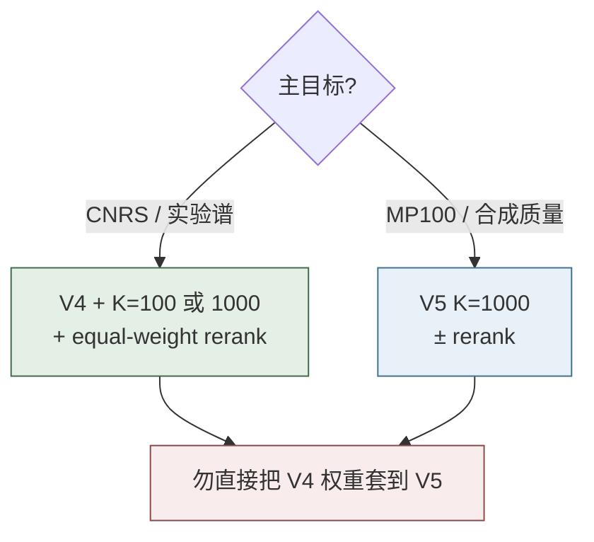
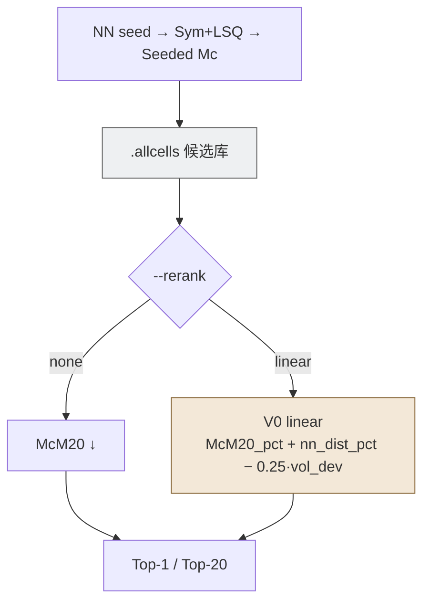
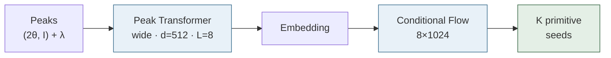

# PXRD Cell Indexer

<p align="center">
  <strong>粉末 XRD 峰表 → Niggli 原胞</strong><br/>
  神经 seed · seeded McMaille · 可选重排 · primitive L4-strict
</p>

<p align="center">
  <code>indexing only</code> · 不做全结构生成<br/>
  产品默认：<strong>V4 + K=100/1000 + equal-weight rerank</strong>
</p>

---

## Pipeline at a glance


```mermaid
flowchart LR
  A["① Peaks + λ"] --> B["② NN Flow<br/>seed ×K"]
  B --> C["③ Symmetrize<br/>+ LSQ"]
  C --> D["④ Seeded<br/>McMaille"]
  D --> E["⑤ Rank<br/>McM20 / V0"]
  E --> F["⑥ Top-1 / Top-20<br/>L4-strict"]

  style A fill:#e8f1f8,stroke:#3d6f8f
  style B fill:#e8f1f8,stroke:#3d6f8f
  style C fill:#e8f1f8,stroke:#3d6f8f
  style D fill:#e8f1f8,stroke:#3d6f8f
  style E fill:#f3e8d8,stroke:#8a6a3d
  style F fill:#e4efe6,stroke:#3d6b4a
```

| 步 | 模块 | 做什么 |
|:--:|------|--------|
| ① | 峰输入 | CNRS：`I≥5 ∪ I≥1`；MP100：模拟峰 |
| ② | NN seed | Peak Transformer + Flow，K=100 / 1000 |
| ③ | Sym + LSQ | 对称化并精修 |
| ④ | Seeded Mc | `policy=1` 局部搜索 → `.allcells` |
| ⑤ | Rank | `none`=McM20；`linear`=V0 重排 |
| ⑥ | Score | **primitive L4-strict** |

> Reranker **只换序**，不碰 seed / LSQ / Mc，也不扩库（`lib` 不变）。  
> 挂接：`scripts/run_cnrs_e2e_compare.py` → `seeded_ordered_cells(--rerank …)`

---

## 1. 产品口径（2026-08）

### Checkpoints

| | V4 **产品默认** | V5 研究 |
|---|---|---|
| Path | `results/flow_seedgen/pxrd_indexer_full6m_v4_wide_lr2e3/best.pt` | `…/pxrd_indexer_full6m_v5_imin/best.pt` |
| Train | full6m · wide · 34 ep · I>5 | + 60 ep · `imin∈{5,2,1}` |
| Launch | `scripts/launch_pxrd_indexer_full6m_v4_wide.sh` | `…_v5_imin.sh` |
| Select | `valid_macro@0.2%`（valid 仍固定 I>5） | 同左 |

### 看板 · CNRS（真实谱，n=123）

产品优先看这块。

| 配置 | Top-1 | lib |
|------|------:|----:|
| V4 · K=100 · McM20 | 39.0% | 64.2% |
| **V4 · K=100 · + rerank** | **43.1%** | 64.2% |
| V4 · K=1000 · McM20 | 31.7% | 68.3% |
| **V4 · K=1000 · + rerank** | **41.5%** | 68.3% |
| V5 · K=100 · McM20 | 40.7% | 64.2% |
| V5 · K=100 · + rerank | 39.8% | 64.2% |

```mermaid
xychart-beta
  title CNRS Top-1 % (primitive L4-strict)
  x-axis ["V4 K100 McM", "V4 K100 RR", "V4 K1k McM", "V4 K1k RR", "V5 K100 McM", "V5 K100 RR"]
  y-axis "Top-1 %" 25 --> 50
  bar [39.0, 43.1, 31.7, 41.5, 40.7, 39.8]
```

### 看板 · MP100（模拟，n=100）

| 配置 | Top-1 | lib |
|------|------:|----:|
| V4 · K=100 · McM20 | 49% | 59% |
| V4 · K=1000 · + rerank | 57% | 69% |
| **V5 · K=1000 · McM20** | **59%** | **74%** |
| V5 · K=1000 · + rerank | 60% | 75% |

```mermaid
xychart-beta
  title MP100 Top-1 % (primitive L4-strict)
  x-axis ["V4 K100", "V4 K1k+RR", "V5 K1k McM", "V5 K1k+RR"]
  y-axis "Top-1 %" 40 --> 70
  bar [49, 57, 59, 60]
```

**怎么选**


```mermaid
flowchart TD
  Q{"主目标?"}
  Q -->|CNRS / 实验谱| P["V4 + K=100 或 1000<br/>+ equal-weight rerank"]
  Q -->|MP100 / 合成质量| R["V5 K=1000<br/>± rerank"]
  P --> N["勿直接把 V4 权重套到 V5"]
  R --> N

  style P fill:#e4efe6,stroke:#3d6b4a
  style R fill:#e8f1f8,stroke:#3d6f8f
  style N fill:#f8ecec,stroke:#8a4a4a
```

多引擎对标（JADE / Mc / TREOR…）见下方文档索引。

---

## 2. 五条结论

1. **K↑ 抬 lib、压 McM20 Top-1** → K=1000 必须配能迁移的排序（当前 V0）。
2. **Rerank V0**：`McM20_pct + nn_dist_pct − 0.25·vol_dev`；合成优选 / XGB 跨不过 CNRS，故锁等权重。
3. **Rerank 边界**：只换序；会 help/hurt；跟 seed 分布强耦合；峰匹配 FOM 往往伤分。
4. **V5 vs V4**：valid / MP100↑；CNRS 正交与 raw lib 未兑现 → **合成更好 ≠ 实验更好**。
5. **下一步**：别只堆同分布数据；优先实验域对齐 + 新 seed 上重标定排序。

---

## 3. Reranker V0


```mermaid
flowchart TD
  S["NN seed → Sym+LSQ → Seeded Mc"] --> AC[".allcells 候选库"]
  AC --> R{"--rerank"}
  R -->|none| M["McM20 ↓"]
  R -->|linear| L["V0 linear<br/>McM20_pct + nn_dist_pct − 0.25·vol_dev"]
  M --> T["Top-1 / Top-20"]
  L --> T

  style L fill:#f3e8d8,stroke:#8a6a3d
  style AC fill:#eef0f2,stroke:#666
```

| | |
|---|---|
| 实现 | [`src/pxrd_cell_indexing/rerank/linear_v0.py`](src/pxrd_cell_indexing/rerank/linear_v0.py) |
| 默认权重 | `(1, 1, 0.25)` → [`results/rerank_v0/current/`](results/rerank_v0/current/) |
| 训练数据 | `data/rerank/`（gitignore，可重建） |
| 设计 / 冻结 | [设计方案](docs/开发日志/20260731-Reranker设计与实验方案.md) · [冻结评测](docs/实验记录/20260731-Reranker-V0训练与冻结评测.md) |

```bash
python scripts/eval_rerank_freeze.py --model results/rerank_v0/current/model.json
```

---

## 4. 模型 · Flow seed


```mermaid
flowchart LR
  P["Peaks<br/>(2θ, I) + λ"] --> T["Peak Transformer<br/>wide · d=512 · L=8"]
  T --> E["Embedding"]
  E --> F["Conditional Flow<br/>8×1024"]
  F --> K["K primitive<br/>seeds"]

  style T fill:#e8f1f8,stroke:#3d6f8f
  style F fill:#e8f1f8,stroke:#3d6f8f
  style K fill:#e4efe6,stroke:#3d6b4a
```

| 项 | V4 / V5 共用 |
|----|----------------|
| Backbone | peaktf wide · FFN 2048 · out 1024 |
| Flow | 8×1024 |
| Optim | global batch 2048 · lr `2e-3` · bf16 |
| Select | `valid_macro@0.2%` · MP100 探针 |

V5 仅多：`epochs=60`、训练时 `peak_imin_choices=5,2,1`。

```bash
bash scripts/launch_pxrd_indexer_full6m_v4_wide.sh
bash scripts/launch_pxrd_indexer_full6m_v5_imin.sh
```

核心：`scripts/train_flow_seedgen.py` · `src/pxrd_cell_indexing/data/dataset.py`

---

## 5. 指标与数据

| | |
|---|---|
| **输入** | `(2θ, I)` + `λ`（默认 Cu Kα 1.54184 Å） |
| **输出** | Niggli 六参数 → e2e Top-k |
| **契约** | peaks-only（无 formula / 无真实 CS） |
| **产品 KPI** | CNRS / MP100 · L4-strict · Top-1 · Top-20 · lib |
| **选模** | `valid_macro@0.2%`（I>5） |
| **数据** | full6m LMDB（外部）· 合成谱 + 增强 |

旧栈（A3-G1 raw + q-search）仍在仓库里，**不是产品主线**。

---

## 6. Quick start

```bash
pip install -e ".[dev]"
make test
```

### 端到端评测

```bash
# CNRS（多阈值并集；需本地 McMaille）
python scripts/run_cnrs_e2e_compare.py --rerank none     # McM20
python scripts/run_cnrs_e2e_compare.py --rerank linear   # V0

# MP100：dump seed → reseed（在 third_party/McMaille/run_lab/）→ 汇总
python scripts/dump_flow_seed_pool.py ...
python scripts/summarize_mp100_benchmark.py ...
```

对标脚本：`run_cnrs_classic_engines.py` · `run_mp100_classic_engines.py` · `summarize_*_benchmark.py`

### 本地依赖（不进 git）

| 资源 | 说明 |
|------|------|
| 训练 LMDB | 外部 `pxrd_241113_*.lmdb` |
| Checkpoint | `results/flow_seedgen/**/best.pt` |
| 经典引擎 | `third_party/`（Mc / TREOR / ITO / DICVOL） |
| CNRS 数据 | 见实验记录路径 |

---

## 7. 仓库结构

```text
pxrd-cell-indexer/
├── README.md · AGENT.md
├── configs/
├── docs/
│   ├── 开发日志/          # 方案 · 决策 · 周报
│   ├── 实验记录/          # 单次实验
│   └── references/
├── src/pxrd_cell_indexing/
│   ├── data/ · model/ · training/
│   ├── search/            # 历史 q-search
│   ├── rerank/            # V0 linear
│   └── geometry.py · eval.py
├── scripts/               # train · e2e · rerank · 对标
├── tests/
├── data/MP-100samples-benchmark/
├── results/               # gitignore（保留 rerank_v0 清单）
└── third_party/           # 本地引擎 · gitignore
```

---

## 8. 文档索引

| 文档 | 内容 |
|------|------|
| [V5 + Rerank vs V4](docs/实验记录/20260802-V5加Reranker端到端对比V4.md) | 最新端到端看板 |
| [Reranker V0 冻结](docs/实验记录/20260731-Reranker-V0训练与冻结评测.md) | 四池数字 |
| [Reranker 设计](docs/开发日志/20260731-Reranker设计与实验方案.md) | 方案与 Gate |
| [K=1000 消融](docs/实验记录/20260731-K1000消融-CNRS与MP100.md) | K 与排序 |
| [CNRS 多引擎](docs/实验记录/20260729-CNRS多引擎L4对标.md) | 真实谱对标 |
| [MP100 + JADE9](docs/实验记录/20260731-MP100多引擎L4对标含JADE9.md) | 模拟谱对标 |
| [起点](docs/开发日志/起点.md) | 项目背景 |
| [AGENT.md](AGENT.md) | 协作约定 |

---

## License

TBD.
