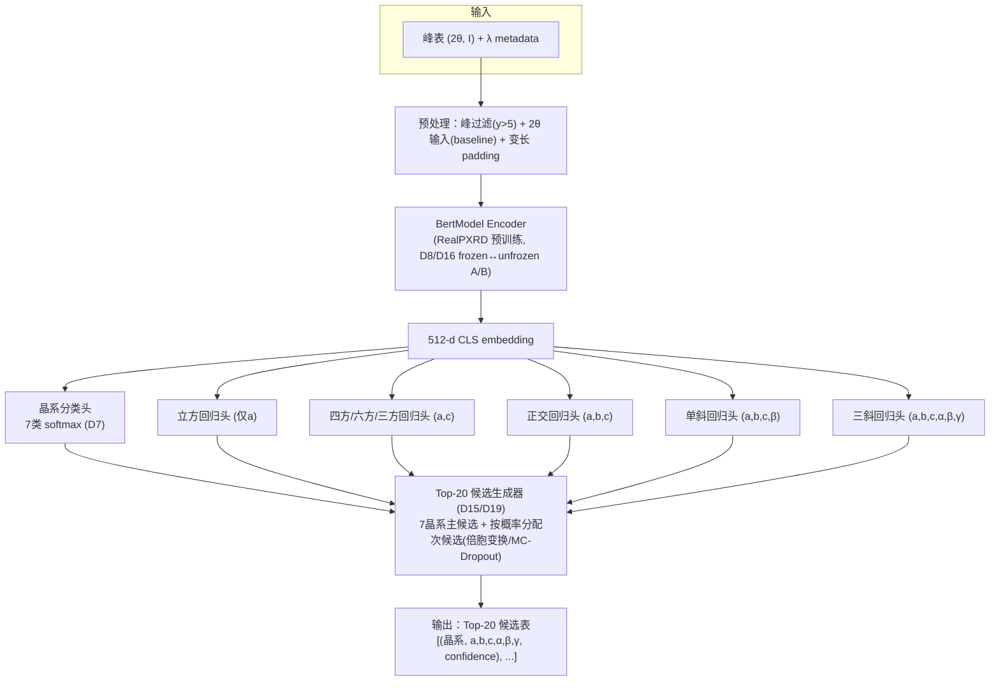
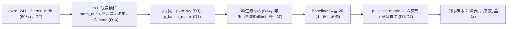

# Step 2 — 方案设计

> **状态**：🟢 D1–D20 已全部确认；首个 10k baseline 采用 **RealPXRD-compatible 2θ 输入**（见 §5.1）；`max_peaks` 首跑不设硬截断
> **最后更新**：2026-07-07（RealPXRD-compatible baseline 执行顺序修正；M1.3 encoder vendoring 进行中）
> **前置依据**：`docs/00-requirements.md`、`docs/开发日志/20260707-PM决策与待确认清单.md`、`docs/开发日志/20260707-RealPXRD-Solver深度调研.md`、`docs/开发日志/20260707-文献调研-损失函数TopK冻结策略建议.md`

---

## 1. 技术原理简述

**任务**：给定一条 PXRD 峰表（`2θ` 或 `d`、强度 `I`，+ 已知波长 `λ`），预测：
1. **晶系**（7 类：立方/四方/正交/六方/三方/单斜/三斜）
2. **primitive 晶胞六参数** `(a, b, c, α, β, γ)`
3. 以 **Top-20 候选表**（D19）形式输出（每个候选含晶系 + 六参数 + confidence），对齐 McMaille/JADE 等传统 indexing 工具的输出形态

**核心思路**：不从零训练，**复用 RealPXRD-Solver 的 `BertModel` XRD encoder**（Transformer，变长峰表输入 → 512 维 embedding）做特征提取器，在其上新增「晶系分类头 + 晶系条件化 lattice 回归头」，砍掉原 decoder 的原子结构生成部分。

**方法论参考**（详见文献调研日志）：
- 晶系条件化回归 inductive bias → `Chitturi et al., J. Appl. Cryst. 2021`
- 端到端 PXRD indexing 标杆（Top-5 晶系~97%、MAPE<5%）→ `AIdex, JCIM 2025`
- 多任务 loss 自动配权 → `Kendall et al., CVPR 2018`
- Top-K / 多候选训练范式 → `Multiple Choice Learning`（NeurIPS 2012/2016）、`Annealed MCL`（NeurIPS 2024）
- d-I 表征的仪器不变性 → `RealPXRD-Solver 正式论文, Nat. Commun. 2025`

---

## 2. 整体架构图



---

## 3. 模块划分

| 模块 | 路径（规划） | 职责 | 状态 |
|---|---|---|---|
| `data/` | `src/pxrd_cell_indexing/data/` | LMDB 读取、峰过滤（y>5）、2θ baseline、jsonl 驱动抽样、augment_spectrum、collate | ✅ M1.4 完成 |
| `model/encoder/` | `src/pxrd_cell_indexing/model/encoder/` | vendor 精简版 `BertModel`（+ transformer 子模块）+ 手动摘取 state_dict 加载（D17） | ✅ M1.3 完成 |
| `model/heads.py` | `src/pxrd_cell_indexing/model/heads.py` | 晶系分类头 + 全 6 参数回归头 + `IndexingModel` | ✅ M1.5 完成 |
| `losses.py` | `src/pxrd_cell_indexing/losses.py` | CE + SmoothL1（固定 1:1）；uncertainty weighting 脚手架 | ✅ M1.5 完成 |
| `eval.py` | `src/pxrd_cell_indexing/eval.py` | 晶系 acc、lattice MAE/MAPE、Top-1 match proxy | ✅ M1.5 完成 |
| `training/` | `src/pxrd_cell_indexing/training/` | `TrainConfig` + `Trainer`（AdamW/warmup/TensorBoard） | ✅ M1.6 完成 |
| `scripts/train.py` | `scripts/train.py` | CLI 训练入口 | ✅ M1.6 完成 |
| `pipeline.py` | 已存在（stub） | 预处理→推理→后处理编排 | 🟡 Step 3 stub 已扩展 |
| `types.py` | 已存在（stub） | 数据契约 | 🟡 已扩展 Top-K / `PXRDPeakTable` |
| `model/topk.py` | `src/pxrd_cell_indexing/model/topk.py` | Top-K 候选生成（D26） | ✅ M1.7 完成 |
| `data/mp100.py` | `src/pxrd_cell_indexing/data/mp100.py` | MP100 CIF→峰表模拟 + primitive truth | ✅ M1.7 完成 |
| `scripts/eval_mp100.py` / `eval_valid.py` | `scripts/` | MP100 / valid1400 lattice match 评测 | ✅ M1.7 完成 |
| `configs/` | `configs/*.yaml` | 超参配置（数据/模型/训练），简单 yaml+dataclass 加载（D18，不用 Hydra） | ✅ M1.6 完成 |

---

## 4. 关键接口 / 数据契约（对 `types.py` 的扩展规划）

```python
class PXRDPeakTable(BaseModel):
    """变长峰表（对齐 BertModel 输入契约）"""
    two_theta: list[float]          # baseline: 原始 2θ；d-spacing 留作后续消融
    intensity: list[float]          # 0-100 归一化
    wavelength_angstrom: float      # λ，metadata（D4/D11）
    peak_num: int                    # len(two_theta)

class LatticeCandidate(BaseModel):
    crystal_system: str              # cubic/tetragonal/... (D7 七分类之一)
    a: float; b: float; c: float
    alpha: float; beta: float; gamma: float
    confidence: float                # 该候选的排序置信度 (D12)

class IndexingResult(BaseModel):
    sample_id: str
    candidates: list[LatticeCandidate]   # Top-K，按 confidence 降序 (D12/D15)
    # TODO: 澄清 K 的具体取值（见 §9.5）
```

> **与现有 stub 的差异**：当前 `IndexingInput/IndexingResult` 只支持单一 `CellParameters`，需要扩展为 Top-K 候选列表；`PXRDProfile` 需要从"固定网格谱"改为"变长峰表 + peak_num"。这一步在 PM 确认本设计稿后，作为 Step 3 骨架更新的一部分执行。

---

## 5. 数据与标签流程（汇总 D1–D3、D7、D10–D11、D16）

### 5.1 首个 baseline 策略（RealPXRD-compatible，2026-07-07 PM 澄清）

首个 10k smoke baseline **必须与 RealPXRD encoder 预训练口径对齐**，否则无法判断 encoder 迁移是否有效：

| 项 | 首个 baseline | 后续消融 |
|---|---|---|
| 位置轴 | **原始 `2θ`（`pxrd_x.long()` → `embed_positions`）** | `2θ→d` bucketization（D16 论文方向） |
| 强度过滤 | **`y > 5`**（与 RealPXRD 训练一致） | 同左 |
| `max_peaks` | **`null`（不硬截断）** | 仅在显存/速度成为瓶颈时再评估 51/75 |
| `xrd_augment` | **调试期 false；正式 smoke 训练 train 开 / valid 关**（对齐 RealPXRD，D21） | 后续按 indexing 任务调参 |

**valid 集（D22）**：不复用 10k train 切片；从真实 `pxrd_241113_valid.lmdb` 全量扫描后分层抽 **1,400 条（7 晶系各 200，seed=42）**，产出 `valid1400_seed42.jsonl`，供 smoke 早停/A-B 对比。

**数据增强（D21，沿用 RealPXRD 原值）**：`app/data/dataset.py::augment_spectrum`，仅训练集、在 `y>5` 过滤后施加——高斯噪声（`N(0, 0.05·max I)`）+ 每峰独立位移（`±0.1°`）+ 强度缩放（`×U(0.8,1.2)`，负值回退）+ 重归一化到 max=100。**D23**：增强后二次 `y>5` 过滤按 upstream 原样复现（引用增强前强度，实际为 no-op）。注意首个 baseline 保留 2θ 且 encoder 用 `pxrd_x.long()` 整数索引，`±0.1°` 位移取整后基本不改索引，故增强主要作用于强度分支。

d-I 表征保留为**后续消融/论文新版对齐分支**，不混入首个 baseline。



- **训练标签口径**：primitive 六参数（D1），晶系由 primitive 结构推导（D7）
- **训练输入口径（baseline）**：Cu Kα 理想模拟峰表（D11），**保留 2θ 轴**以加载 RealPXRD `xrd_encoder` 权重
- **valid/benchmark 分工**：`pxrd_241113_valid.lmdb` 调参早停；`MP-100samples-benchmark` 最终对照，CIF truth 转 primitive 后比较（D5/D6）

---

## 6. 模型细节

### 6.1 Encoder（D8）

| 项 | 值 | 来源 |
|---|---|---|
| 结构 | `BertModel`（2 层 Transformer，embed_dim=32，4 heads） | `archive/RealPXRD-Solver/app/model/bert.py` |
| 输入 | 变长峰表 `(pxrd_x, pxrd_y, peak_num)` | 与 D4 一致 |
| 输出 | 512-d，L2 归一化 | `CSPFlow.forward` 内 `F.normalize` |
| 预训练权重 | `pretrained/weight/2501/pxrd-all/last_one.ckpt`（~145MB） | 调研日志 §6 |
| 冻结策略 | 10k smoke 阶段 frozen vs unfrozen(小LR) A/B（D16） | 文献调研 §3 |

### 6.2 输出头（D9/D15/D25）

- **晶系分类头**：`Linear(512→7)` + CE，作为**辅助任务** + 推理期 Top-K 组织（D25）
- **Lattice 回归头**：`MLP(512→6)`，预测**全部 6 个 primitive 参数**（归一化空间），不做惯用胞硬 mask

> **D25 口径修正（2026-07-07）**：设计初稿的晶系条件化自由参数表按**惯用胞**书写，与 D1 primitive 标签矛盾（例：cubic primitive 角度中位数 60° 而非 90°，hexagonal `a=b` 仅 ~49%）。首个 baseline **回归全 6 参数**；primitive 条件化 mask 降为后续消融。

| 晶系 | 首个 baseline 监督 | 后续消融（可选） |
|---|---|---|
| 全部 | `a,b,c,α,β,γ` 六参数全回归 | 按 primitive 定心类型推导 mask |

### 6.3 损失函数（D9）

```
L = CE(crystal_system) + SmoothL1(lattice_norm, 全6参数)   # 首个 baseline 固定 1:1
```
- 后续切换：`uncertainty_weighting`（Kendall）与 primitive 条件化 mask 消融

### 6.3b Lattice 标签归一化（D24）

- 长度 `a,b,c`：共享 `log` + z-score（统计量仅来自 train10k）
- 角度 `α,β,γ`：z-score
- 统计文件：`data/processed/lattice_stats_seed42.json`；训练在归一化空间，评测反归一化

### 6.4 Top-K 候选生成（D12/D15/D19/D26，**K=20**）

**D25 适配**：单头回归只输出**一组**六参数，不再按晶系分头。Top-K 生成（[`model/topk.py`](../src/pxrd_cell_indexing/model/topk.py)）策略：

1. **主候选**：分类 argmax 晶系 + 回归六参数 + softmax 概率；
2. **次晶系假设**：同一组六参数，按分类概率排序赋予其他晶系标签（最多 6 个）；
3. **倍胞/子胞变体**：对主晶格施加 ×2、×½、×√2、×√3 等长度缩放，以及单轴缩放，填满剩余名额；
4. **可选 MC-Dropout**：`build_top_k_with_mc_dropout` 合并多次前向采样候选；
5. 去重后按 confidence 排序，截断至 K=20。

**评测对齐**：lattice match rate（`ltol=0.3, atol=10°`，pymatgen `Lattice.find_mapping`，**纯晶格、非原子级 StructureMatcher**）；"Top-K oracle" = 20 候选中任一命中即算对。

> **注意**：倍胞变体会抬高 Top-K oracle recall；正式对比 Mc/JADE 时以 **Top-1 lattice match** 为主指标。

---

## 7. 评测方案（D5/D6）

| 集合 | 用途 | 口径 |
|---|---|---|
| `pxrd_241113_valid.lmdb`（2.5万） | 训练期调参/早停 | 与训练同分布 |
| `MP-100samples-benchmark`（100 CIF） | 最终对照 McMaille/JADE9 | CIF truth → primitive 再比较 |

**主指标**（`起点.md` 口径，**indexing 任务，纯晶格**）：
- **Top-1 lattice match rate**（`ltol=0.3, atol=10°`，pymatgen `Lattice.find_mapping`）— 与 McMaille/JADE9 对照的主指标
  - `find_mapping` **接受倍胞/子胞几何等价**；该指标衡量的是 indexing 几何命中，**非**逐参数回归精度（后者看 `length_mape` / `lattice_mae`）
- **Top-1 joint match rate**（lattice match **且** 晶系分类正确）— 更严格的“完整输出正确率”，与 Mc/JADE lattice-only 口径区分
- **Top-K lattice match rate**（oracle：K 候选中任一命中）— 候选池召回
- 晶系准确率
- 训练期快速监控：`top1_lattice_match_proxy`（几何近似，非 pymatgen）

**不做**：原子级完整 `StructureMatcher`（结构生成任务指标，非 indexing baseline 必需）。

**MP100 峰表口径**（M1.7）：CIF → `SpacegroupAnalyzer` conventional standard → reduced → `XRDCalculator(CuKα, 2θ∈[5,80], scaled=True)` → `y>5` 过滤，与 `241113_save_pxrd_data.py` 一致。

**参照基线**（ideal 峰，起点.md）：McMaille ~76.4%、JADE9 ~72.5%、RealPXRD Without L ~5%（不可比，任务错配）

---

## 8. 已知风险与缓解

| 风险 | 影响 | 缓解 |
|---|---|---|
| 首个 baseline 若混入 `2θ→d`，`pxrd_x.long()` position embedding 与预训练权重失配 | 无法验证 RealPXRD encoder 迁移是否有效 | **首个 baseline 保留 2θ**；d-I 仅作后续消融 |
| 峰数无硬上限，长尾样本 attention O(N²) | 显存/速度风险（24GB 单卡） | 首个 baseline **`max_peaks=null`**；M1.2 统计后再评估是否截断（§9.3） |
| encoder 端到端微调可能过拟合小样本(10k) | smoke 阶段指标失真 | D16 A/B 对比，全量训练倾向差异化 LR |
| 晶系条件化回归头在晶系分类错误时无法自愈（分类错→回归头选错） | Top-1 表现可能被分类误差拖累 | Top-K 设计已缓解（错误晶系仍可能在 Top-K 内）；后续可评估"回归头对所有晶系都跑一遍，只用分类做排序"的变体 |
| 训练数据全部 Cu Kα，与真实多仪器场景有 gap | 部署泛化风险 | D16 已提前用 d 表征铺路；产品侧仍需 P1 阶段做多 λ 验证 |
| K=20 但晶系头仅 7 个，"晶系内多候选"生成方式偏启发式（倍胞变换/MC-Dropout） | 若启发式效果不佳，Top-20 recall 可能达不到预期 | 先跑通启发式版本测出 Top-20 recall 曲线，不够再补 Annealed WTA 子头（§6.4） |

---

## 9. 技术栈与工程细节（D17–D20，2026-07-07 第五轮已确认）

| # | 问题 | 结论 | 状态 |
|---|---|---|---|
| 9.1 | Encoder 依赖 / vendoring 策略 | **D17：方案 B，精简 vendoring**——只拷 `bert.py`+`transformer/` 子模块，手动摘取 `xrd_encoder.*` state_dict 加载；不依赖 lightning/hydra/torch_geometric/torch_scatter | ✅ |
| 9.2 | 训练框架 / 配置管理技术栈 | **D18：原生 PyTorch + 简单 yaml/dataclass 配置**，不引入 Lightning/Hydra | ✅ |
| 9.3 | 峰数计算成本 / `max_peaks` | M1.2 统计完成：median=17、p95=**51**、p99=**75**、max=543；**首个 RealPXRD-compatible baseline 不硬截断**；51/75 仅在 smoke 出现显存/速度瓶颈时再评估 | 🟡 baseline 已定 null；截断数值留作后备 |
| 9.4 | Top-K 的具体 K 值 | **D19：K=20**（对齐 RealPXRD/AIdex 行业习惯的 Top-20 报告口径）；由于晶系头只有 7 个，需要"晶系内多候选"设计，见 §6.4 | ✅ |
| 9.5 | 实验管理与产物落盘规范 | **D20：TensorBoard**；checkpoint 保留策略留到写训练脚本时随手定（只留 best + 最新一份，避免 24GB 单卡机器磁盘压力） | ✅ |
| 9.6 | 部署寻峰对齐 | 留到产品化阶段，不影响当前训练 | ⚪ 非阻塞 |
| 9.7 | MP100 评测峰口径 | 留到写评测脚本时明确（避免历史"口径混用"重演） | ⚪ 非阻塞 |
| 9.8 | 晶系细化到 space group/extinction group | **PM 明确：不考虑**，维持 7 大晶系粒度，任务边界到此为止 | ✅ 已收敛，关闭 |

**依赖清单更新**（按 D17/D18/D20，供 Step 3 骨架落地时写入 `requirements.txt`/`pyproject.toml`）：

```
torch          # encoder 前向 + 训练循环（原生 PyTorch，D18）
pymatgen       # 标签推导（primitive/晶系）、lattice match 评测（StructureMatcher）
numpy
tensorboard    # 实验记录，D20
pyyaml         # 简单配置文件，D18
# 不引入：lightning / hydra-core / torch-geometric / torch-scatter（D17 已否决完整依赖方案）
```

---

## 10. 候选方案对比（已拍板项的留痕，供审计）

| 决策点 | 方案 A（采纳） | 方案 B（否决） | 否决理由 |
|---|---|---|---|
| Top-K 实现 | 7 晶系头天然 Top-K | 纯 WTA 多头（不分晶系） | WTA 已知对初始化敏感、易头坍缩；晶系头方案训练更稳定且天然可解释 |
| 回归 loss | 晶系条件化 mask 回归 | 无差别回归 6 参数 | 无差别回归会在恒定角度（90°/120°）上产生 trivial 梯度，稀释训练信号 |
| 首个 baseline 输入轴 | **保留 2θ（RealPXRD-compatible）** | 首个 baseline 直接用 d-I | 预训练权重与 `embed_positions(pxrd_x.long())` 绑定；d-I 作后续消融 |
| encoder 复用范围 | 只复用 encoder，新建 indexing head | 复用整个 CSPFlow decoder 改造 | decoder 是 flow matching 生成式结构，与 supervised 分类回归任务形态不匹配 |

---

## 11. 里程碑（细化 `04-progress.md` 的 M1）

| 里程碑 | 目标 | 状态 |
|---|---|---|
| M1.1 | PM 确认本设计稿 + §9 全部事项（D17–D20） | ✅ 完成 |
| M1.2 | 10k 数据抽样脚本 + 峰数分布统计（回答 §9.3 `max_peaks`） | ✅ 完成 |
| M1.3 | Encoder vendoring（方案 B，D17）+ 单元测试（加载权重、单 batch forward） | ✅ 完成 |
| M1.4 | Dataset/Dataloader（峰过滤、2θ baseline、padding、10k+valid1400 抽样） | ✅ 完成 |
| M1.5 | Model heads + masked loss + uncertainty weighting | ✅ 完成（全6参数回归 + 固定1:1 loss；uncertainty 脚手架） |
| M1.6 | 10k smoke 训练跑通（frozen vs unfrozen A/B，D16） | ✅ 完成 |
| M1.7 | Top-K 评测脚本（lattice match rate 等）+ MP100 对照 | ✅ 完成（链路打通；真实数字留 M2） |
| M1.8 | 10k 调优与诊断（误差分析 + loss/epoch 消融） | ✅ 完成 |
| M2 | 全量 241113 训练 | ⚪ |
| M3 | MP100 benchmark 正式评测 + 基线对照报告 | ⚪ |

---

## 12. 下一步

- [x] PM 逐项确认 §9（D17–D20，2026-07-07 第五轮）
- [ ] 更新 `docs/02-skeleton.md`（真实模块目录树）与 `types.py`（Top-K 契约、`PXRDPeakTable`）
- [ ] `requirements.txt` / `pyproject.toml` 按 §9 依赖清单补全（torch/pymatgen/numpy/tensorboard/pyyaml）
- [ ] 仍不写训练业务代码，直到骨架（Step 3）经 PM 确认
