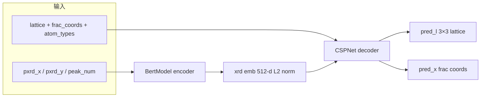
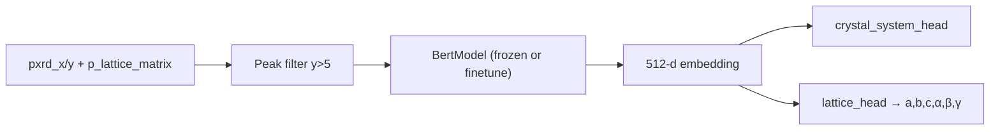

# 2026-07-07 — RealPXRD-Solver 深度调研

> **当前步骤**：Step 2 前置 — baseline 技术摸底（**只读调研，未改代码**）  
> **动机**：PM D8 确认 baseline 复用 RealPXRD encoder；需弄清架构、输入契约、权重路径及与本任务的衔接方式  
> **代码位置**：[`/nanolab/users/wyx/archive/RealPXRD-Solver`](../../../archive/RealPXRD-Solver)（2026-07-06 归档）

---

## 1. 结论摘要

| 问题 | 结论 |
|---|---|
| RealPXRD-Solver 是什么？ | **PXRD 条件下的晶体结构生成**（Flow Matching + GNN），**不是**专用 cell indexing 引擎 |
| 可复用部分 | **`BertModel` XRD encoder** → 512 维 L2 归一化向量 |
| 输入形态 | **变长峰表** `(pxrd_x, pxrd_y, peak_num)`，**非**固定角度网格 |
| 训练数据口径 | `conventional=False` → **primitive** `p_*` 字段；峰过滤 `y>5`、max=100 |
| 推荐权重 | `pretrained/weight/2501/pxrd-all/last_one.ckpt`（~145 MB，Without L 全量） |
| 与 indexing 任务关系 | Without L lattice match ~**5%**（MP100）；encoder 可迁移，**decoder/flow 不适合直接当 indexing** |
| 对 D4 的含义 | 与 RealPXRD 对齐 → **倾向变长峰表（3a）**，无需固定网格重采样 |

---

## 2. 仓库结构与入口

```
archive/RealPXRD-Solver/
├── main.py                 # Hydra + Lightning 训练入口
├── conf/
│   ├── model/flow.yaml     # CSPFlow + BertModel + CSPNet 超参
│   └── data/v241113.yaml   # 241113 LMDB 数据配置
├── app/
│   ├── model/
│   │   ├── flow.py         # CSPFlow（LightningModule）
│   │   ├── bert.py         # ★ BertModel（XRD encoder）
│   │   └── cspnet_xrd.py   # CSPNet（结构解码器）
│   └── data/
│       ├── dataset.py      # CrystDataset_pxrd
│       └── datamodule.py
├── scripts/
│   ├── sample_flow.py      # Without L 推理
│   ├── sample_flow_L.py    # With L 推理（固定晶格）
│   └── eval_utils.py       # lattice matrix ↔ 六参数
└── pretrained/weight/2501/
    ├── pxrd-all/last_one.ckpt      # ★ 全量 Without L
    ├── pxrd-all-L/last_one.ckpt    # 全量 With L
    ├── pxrd-atom25/                # 小数据 smoke
    └── pxrd-atom25-L/
```

**无根目录 README**；最佳内部文档：[`archive/RealPXRD-Solver/测试log/smoke_test_report_20260508.md`](../../../archive/RealPXRD-Solver/测试log/smoke_test_report_20260508.md)

**关联但不在本仓库**：McMaille/JADE indexing 引擎、`RealPXRD-APP-开发测试/`（见 [`起点.md`](起点.md)）。

---

## 3. 整体架构：CSPFlow



**训练目标**（Flow Matching，`app/model/flow.py`）：

- 对 lattice、分数坐标加噪插值，decoder 预测速度场
- 损失：`loss = cost_lattice * MSE(pred_l) + cost_coord * MSE(pred_x)`
- 默认：`cost_lattice=1`，`cost_coord=100`

**两种变体**（`cost_lattice` 控制）：

| 变体 | checkpoint | `cost_lattice` | 行为 |
|---|---|---:|---|
| **Without L** | `pxrd-all` | 1.0 | 联合预测 lattice + 坐标（结构生成） |
| **With L** | `pxrd-all-L` | 0 | 固定输入晶格，只生成坐标 |

本任务只需 **encoder**；decoder 是生成式结构求解，与「PXRD → 晶系 + lattice 回归/分类」任务形态不同。

---

## 4. XRD Encoder — `BertModel`（复用核心）

**文件**：[`archive/RealPXRD-Solver/app/model/bert.py`](../../../archive/RealPXRD-Solver/app/model/bert.py)

### 4.1 超参数（`conf/model/flow.yaml`）

| 参数 | 值 |
|---|---|
| `output_dim` | 512 |
| `max_seq_len` | 180 |
| `encoder_layers` | 2 |
| `encoder_embed_dim` | 32 |
| `encoder_ffn_embed_dim` | 32 |
| `encoder_attention_heads` | 4 |

### 4.2 结构

1. **强度嵌入**：`pxrd_y` → `Linear(1→32) → LN → ReLU → Linear(32→32)`
2. **位置嵌入**：`pxrd_x`（**cast 为 long**）→ `Embedding(180, 32)`
3. **CLS token** + 2 层 `TransformerEncoder`
4. **输出**：取 CLS → `Linear(32→512)` → `[B, 512]`

### 4.3 输入契约（PyG Batch）

| 张量 | Shape | 说明 |
|---|---|---|
| `pxrd_x` | `[total_peaks, 1]` | 2θ（°），batch 内按样本拼接 |
| `pxrd_y` | `[total_peaks, 1]` | 强度（0–100） |
| `peak_num` | `[B]` | 每个结构的峰数 |
| **输出** | `[B, 512]` | CSPFlow 内再 `F.normalize(dim=-1)` |

`batch_input()` 将 flat 峰序列 pad 为 `[B, max_peaks, 1]`，padding 位置 mask 掉。

### 4.4 峰表预处理（训练，`CrystDataset_pxrd`）

```python
mask = pxrd_y > 5          # 相对强度阈值
pxrd_x_final = pxrd_x[mask]
pxrd_y_final = pxrd_y[mask]
# 训练集可选 xrd_augment：噪声、±0.1° shift、0.8–1.2 缩放，再归一化 max=100
```

**与 LMDB 原始字段一致**（PM D3：直接用现有 `pxrd_x/y`）。

### 4.5 推理侧峰提取（`scripts/sample_flow.py`）

从连续 xy 文件：
1. 6 阶多项式背景扣除
2. `scipy.find_peaks`（height≥5, width≥3, prominence）
3. 强度归一化 max=100

训练用 LMDB 预计算峰表；部署用连续谱 → 峰表，**encoder 接口相同**。

---

## 5. 数据管线（与 alex_aflow_oqmd_mp 对齐）

**Dataset**：`CrystDataset_pxrd`（[`app/data/dataset.py`](../../../archive/RealPXRD-Solver/app/data/dataset.py)）

| 配置项 | `v241113.yaml` 值 | 与本任务关系 |
|---|---|---|
| `conventional` | **False** | 读 `p_atom_*`、`p_lattice_matrix`（**primitive**，与 D1 一致） |
| `gzip` | True | 与 LMDB 格式一致 |
| `xrd_augment` | train=True | 初实验可关闭便于 debug |
| 数据路径 | `alex_aflow_oqmd_mp/datasets/pxrd_241113_*.lmdb` | 与 PM D2 一致 |

**默认 batch_size**（全量训练）：train=480 / valid=300（4090D 24GB）；冒烟曾压到 8。

---

## 6. 预训练权重

| 文件 | 大小 | 用途 |
|---|---:|---|
| `pretrained/weight/2501/pxrd-all/last_one.ckpt` | ~145 MB | **推荐**：全量 241113 Without L |
| `pretrained/weight/2501/pxrd-all-L/last_one.ckpt` | ~145 MB | With L（固定晶格，不适合本任务） |
| `pxrd-atom25/last_one.ckpt` | 较小 | atom≥25 子集 smoke |

**加载方式**（`scripts/sample_flow.py` 同款）：

```python
from pathlib import Path
from hydra import initialize_config_dir, compose
from app.model.flow import CSPFlow

ckpt_dir = Path(".../pretrained/weight/2501/pxrd-all")
with initialize_config_dir(str(ckpt_dir / ".hydra")):
    cfg = compose(config_name="config")
model = CSPFlow.load_from_checkpoint(str(ckpt_dir / "last_one.ckpt"), **cfg.model)
encoder = model.xrd_encoder  # BertModel
```

**内置冻结钩子**（`flow.yaml`）：`pretrained_xrd` + `freeze=true` 可单独加载/冻结 encoder。

---

## 7. Lattice 相关能力边界

RealPXRD-Solver **没有** McMaille/JADE 式 indexing 模块。

| 能力 | 实现 | indexing 价值 |
|---|---|---|
| Lattice 流预测 | `CSPNet.lattice_out` → 3×3 matrix | Without L Top-1 lattice match **~5%**（MP100 ideal 峰） |
| 六参数工具 | `eval_utils.lattices_to_params_shape` / `lattice_params_to_matrix_torch` | 可复用到本任务标签/评测 |
| With L | 外部传入 cell，只生成坐标 | 产品路径「先 indexing 再生成」 |

**历史结论**（[`起点.md`](起点.md) §2.4、§5.3）：

- RealPXRD Without L **不能**替代 indexing（~5–13% lattice match）
- 专用引擎 McMaille ~76%、JADE9 ~73%
- RealPXRD 价值在 **encoder 表征** 与 **With L 结构生成**（Top-20 SM ~81%）

**对本任务的启示**：复用 encoder 合理；**不要**直接搬 CSPFlow decoder 当 indexing head，应新建 **晶系分类头 + lattice 六参数回归头**。

---

## 8. 建议的 Cell Indexing 复用方案



| 组件 | 建议 |
|---|---|
| Encoder | `BertModel` from `pxrd-all/last_one.ckpt` |
| 输入 | 变长峰表 + `peak_num`（与 RealPXRD 一致） |
| 标签 | primitive 六参数 + primitive 晶系（D1/D7） |
| 初实验数据 | 241113 train **随机 10k**（PM D10）+ valid 2.5 万 |
| 评测 | MP100 CIF truth → primitive（D6） |

**可选**：第一阶段 `freeze=true` 只训 head；第二阶段解冻 encoder 微调。

---

## 9. 依赖与环境

| 包 | 版本 | 必要性 |
|---|---|---|
| PyTorch | 2.4.1+cu124 | 必须 |
| lightning | 2.4.0 | 加载 ckpt 需要 |
| hydra-core | 1.3.2 | 加载 ckpt 需要 |
| torch-geometric | 2.6.1 | Batch/Data 格式 |
| torch-scatter | 2.1.2+pt24cu124 | CSPFlow 完整加载需要 |
| pymatgen | — | 标签/评测 |

安装顺序见 `archive/RealPXRD-Solver/scripts/install_torch_pyg_cu124.sh` + `requirements.txt`。

**本任务后续**：可只 vendoring `bert.py` + transformer 子模块，或子模块依赖 archive 路径；待 Step 2 设计稿定。

---

## 10. 对未决决策的影响

| 决策 | 调研后建议 |
|---|---|
| **D4 输入形态** | **强烈倾向 3a 变长峰表**（与 encoder 原生接口一致；D3 直接用 LMDB 峰） |
| **D9 损失函数** | 可参考 CSPFlow：`cost_lattice=1` vs `cost_coord=100` 的数量级差异 → 晶系 CE 与 lattice 回归需分权重 |
| **D10 少样本** | PM 确认 **10k**；可从 241113 train 随机抽样（固定 seed 可复现） |

---

## 11. 风险与待查证

1. **`pxrd_x` 作 Embedding 索引**：2θ 值为 float 转 long，有效索引范围依赖实际 2θ 数值（通常 5–80）；新任务 dataloader 须 **与训练完全一致** 的 cast 方式。
2. **`max_seq_len=180`**：过滤后峰数 median≈35，但 max 可达 480；超长样本需 **截断或过滤**（待 PM/实验确认）。
3. **checkpoint 加载路径**：`conf/data/v241113.yaml` 中 `file_path` 仍指向旧路径 `RealPXRD-Solver/pretrained/data`，本任务用 `alex_aflow_oqmd_mp/datasets/` 需改配置或新写 dataloader。
4. **`sample_flow_L.py` 引用 `configL`**：仓库内 `.hydra/` 仅有 `config.yaml`，属已知小问题，不影响 encoder 提取。

---

## 12. 下一步（仍不动业务代码，除非 PM 批准）

- [ ] PM 确认 D4 → 变长峰表是否拍板
- [ ] 将 encoder 复用方案写入 `docs/01-design.md`
- [ ] 定义 10k 抽样规范（seed、是否分层 atom_num）
- [ ] 批准后再做：只读加载 ckpt + 单 batch forward smoke

---

## 附录：关键文件索引

| 主题 | 路径 |
|---|---|
| Encoder | `archive/RealPXRD-Solver/app/model/bert.py` |
| 完整模型 | `archive/RealPXRD-Solver/app/model/flow.py` |
| 数据加载 | `archive/RealPXRD-Solver/app/data/dataset.py` |
| 模型配置 | `archive/RealPXRD-Solver/conf/model/flow.yaml` |
| 数据配置 | `archive/RealPXRD-Solver/conf/data/v241113.yaml` |
| 权重 | `archive/RealPXRD-Solver/pretrained/weight/2501/pxrd-all/last_one.ckpt` |
| 历史 benchmark | `docs/开发日志/起点.md` |
