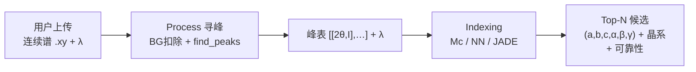

# 2026-07-07 — 输入形态调研：实验 PXRD + λ 场景下该喂什么？

> **触发**：PM 应用场景 — 用户上传**实验 PXRD + 仪器参数 λ** → cell indexing → 多个候选（6 primitive 参数 + 晶系）  
> **问题**：模型/系统到底该输入什么？对照 RealPXRD、McMaille、JADE9、GSAS-II  
> **状态**：调研 + 建议（**暂不动手**）

---

## 1. 你的产品场景（目标数据流）



这与 [`起点.md`](起点.md) §1.1 产品定义一致：

> **输入**：预处理主峰表 `[[2θ, I], …]`（+ 波长；Formula **不参与** Mc 搜索）

---

## 2. 四类工具输入对比

| 维度 | **RealPXRD-Solver** | **McMaille** | **JADE9** | **GSAS-II** |
|---|---|---|---|---|
| **任务** | 结构**生成**（非 indexing） | **专用 indexing** | **专用 indexing** | **专用 indexing** |
| **用户上传** | 连续 `.xy`（2θ+I） | 通常已是**峰表** | 连续谱（内部寻峰） | 连续 PWDR 或峰表 |
| **Indexing 真正吃的** | N/A（生成用峰表） | **峰表 + λ** | 寻峰后的峰位 + λ | **Index Peak List** + 仪器参数含 **λ** |
| **2θ vs d** | 仅 **2θ** | 2θ **或** d（靠排序判断） | 内部 2θ | 2θ 或 d（靠排序判断） |
| **λ 是否必需** | 训练/推理代码**未显式传入**（模拟谱隐含 Cu Kα） | **必需**（`.dat` 第 2 行） | 必需（校准） | 必需（`Lam` 仪器参数） |
| **化学式** | 推理**必需** `--formula` | **不参与搜索**（App 约定） | 可选约束 | indexing 本身不需要 |
| **寻峰预处理** | 6 阶多项式 BG + `find_peaks` + max=100 | 上游 App Process 寻峰 | 内置 BG/Kα2/自动寻峰 | Fit Peaks → 复制到 Index Peak List |
| **峰数** | 过滤 `y>5`；encoder `max_seq_len=180` | 推荐 20 对，**12–100** | 灵活 | 自动搜索 + 用户筛选 |
| **输出** | 全结构 CIF | Top-N 晶胞 + M20* + Grade | 晶胞解 + `.hkl` | 晶胞列表按 **M20** 排序 |
| **代码在本仓库** | ✅ `archive/RealPXRD-Solver` | ❌ App 在 `RealPXRD-APP-开发测试/`（已迁出） | ❌ 同左 | ❌ 曾接入后 **98% timeout 归档** |

---

## 3. 各工具细节

### 3.1 RealPXRD-Solver

**训练**（`CrystDataset_pxrd` + LMDB）：
- 输入：`pxrd_x`（2θ）、`pxrd_y`（强度），过滤 `y>5`，max=100
- **无 λ**；模拟 PXRD 用 pymatgen `XRDCalculator()` 默认 Cu Kα
- 标签：primitive `p_lattice_matrix` + 原子（生成任务）

**推理**（`scripts/sample_flow.py`）：
- 上传：连续 `np.loadtxt` 两列 `[2θ, I]`
- 预处理：6 阶 BG → `find_peaks`（height≥5）→ max=100
- **额外必需**：`--formula`（化学式）
- **无 λ 参数**

**Encoder**（`BertModel`）：变长峰表 `(pxrd_x, pxrd_y, peak_num)` → 512-d

> RealPXRD 是 **PXRD → 全结构生成**，不是「多候选晶胞 indexing」。Without L lattice match ~5%（MP100）。

### 3.2 McMaille（产品主引擎）

**App 集成**（`起点.md`）：
- 输入：`[[2θ, I], …]` + **λ**（Process 寻峰后）
- Formula **不参与** Mc 搜索
- 固定参数：60 peaks / 600s / 30 candidates；弱峰阈值 `min_rel=0.001`

**原生格式**（[McMaille manual](https://www.cristal.org/McMaille/short-manual.html)）：
```
Title
1.54056 0.0 -3          # Wavelength, Zeropoint, Ngrid
11.180  345.             # 2θ (递增) 或 d (递减), Intensity
12.217  1120.
...
```
- 推荐 **~20 对峰**，最少 12，最多 100
- **不接受连续谱**，只吃峰表

### 3.3 JADE9

- 用户通常上传**连续谱**（`.mdi`、`.raw` 等）
- 内部：BG 扣除、Kα2、平滑、**自动寻峰**
- Indexing 在峰位上进行；可选空间群/Miller 约束
- App benchmark：ideal 棒谱 → 导出 `.hkl` 喂 JADE（MP100 lattice match ~72.5%）

### 3.4 GSAS-II

典型 GUI 流程：
1. 导入连续 PWDR
2. 仪器参数设 **λ**（`.instparm`）
3. Peak Fitting → Auto search
4. 复制到 **Index Peak List**
5. 选 Bravais（Cubic-P 等）→ `DoIndexPeaks`
6. 输出按 **M20** 排序的晶胞列表

App 状态：**已归档**（MP100 98% timeout）。

---

## 4. 核心结论：你应该输入什么？

### 4.1 分层答案（推荐）

| 层级 | 输入 | 说明 |
|---|---|---|
| **用户层** | 连续实验谱 `.xy/.csv` + **λ (Å)** | 符合真实上传场景；λ 必须收集 |
| **预处理层**（与 Mc 共用） | BG 扣除 → 寻峰 → 主峰表 `[[2θ, I],…]` | 与 `起点.md` 产品链一致 |
| **模型层**（NN / RealPXRD encoder） | **变长峰表**：`pxrd_x`, `pxrd_y`, `peak_num` | 与 LMDB 训练数据 + BertModel 对齐 |
| **λ 在模型里** | **建议作为全局条件特征**（可选但推荐） | 见 §4.2 |

### 4.2 为什么不是「直接把连续谱喂模型」？

1. **McMaille / 主流 indexing 都吃峰表**，不吃原始连续谱
2. **RealPXRD encoder 训练时就是峰表**，不是固定角度网格
3. 实验连续谱的 BG、噪声、重叠峰会严重干扰；应先 **Process 寻峰**
4. 训练 LMDB 已是模拟峰表（`y>5`），部署也应尽量同分布

### 4.3 λ 怎么处理？

| 观点 | 说明 |
|---|---|
| **若峰表用 2θ（推荐，与 RealPXRD 一致）** | 峰位**已隐含 λ**（同一晶体的 d 固定，2θ 随 λ 变）。McMaille 可直接用 2θ+λ 做内部换算 |
| **训练集现状** | LMDB 模拟谱固定 Cu Kα（~1.54056 Å），**未显式存 λ** |
| **部署若 λ 可变** | 两种策略：(a) 保持 2θ 输入 + 把 λ 作为额外标量条件；(b) 用 λ 将峰位转为 **d-spacing** 再喂模型（需改 encoder 位置嵌入逻辑） |
| **建议** | 短期：**2θ 峰表 + λ 作为 metadata/全局条件**；与 Mc 产品链一致，改动最小 |

### 4.4 与 RealPXRD 训练数据的 gap

| 项目 | 训练 LMDB | 实验部署 |
|---|---|---|
| 谱来源 | pymatgen 模拟（Cu Kα） | 实测连续谱 → 寻峰 |
| λ | 隐含固定 | 用户上传 |
| 峰形 | 理想棒谱 | 宽化、重叠、杂峰 |
| 化学式 | 训练有，推理必需 | **Indexing 不需要**（优势） |

→ 模型要上线，benchmark 除 MP100 ideal 外，还需 **deploy 实测谱 / Process 峰** 验证（`起点.md` P1 遗留项）。

---

## 5. 对 D4（输入形态）的建议

**建议正式拍板**：

| 决策项 | 建议值 |
|---|---|
| **D4 模型输入** | **3a 变长峰表** `(2θ, I)`，过滤 `y>5`，强度 max=100 |
| **用户上传** | 连续谱 + λ（预处理在模型外或统一 Process 模块） |
| **λ** | 产品必填；模型侧先作 **全局条件向量**（或与 encoder 输出 concat） |
| **多候选输出** | 模型需 **Top-K 头** 或多次采样 — McMaille 原生就给 Top-N；当前 RealPXRD encoder 只出单向量，要新设计 |

这与 D3（直接用 LMDB 峰）、D8（RealPXRD encoder）**一致**。

---

## 6. 建议的产品/模型接口（草案）

```python
# 用户上传
class UserUpload:
    continuous_xy: list[tuple[float, float]]  # 2θ, I
    wavelength_angstrom: float                 # λ，必填

# 预处理后 → 模型输入
class ModelInput:
    pxrd_x: list[float]      # 峰位 2θ
    pxrd_y: list[float]      # 归一化强度，max=100
    wavelength_angstrom: float  # 全局条件（推荐保留）

# 模型输出（每个候选）
class IndexingCandidate:
    a, b, c, alpha, beta, gamma: float  # primitive
    crystal_system: str
    confidence: float                   # 类比 M20*/Grade
```

---

## 7. 待 PM 确认

1. **是否同意 D4 = 变长峰表**（用户上传连续谱，系统内寻峰后喂模型）？
2. **λ 是否作为模型条件特征**（而不转 d-spacing）？
3. **寻峰是否与 Mc App Process 对齐**（同一套 BG + find_peaks 参数）？
4. **多候选输出**：Top-K 回归多个晶胞 vs 单次预测 + 外部排序模块？

---

## 8. 参考

- RealPXRD 训练/推理：`archive/RealPXRD-Solver/app/data/dataset.py`、`scripts/sample_flow.py`
- 产品定义：[`起点.md`](起点.md) §1.1
- RealPXRD 深度调研：[`20260707-RealPXRD-Solver深度调研.md`](20260707-RealPXRD-Solver深度调研.md)
- McMaille 手册：https://www.cristal.org/McMaille/short-manual.html
- GSAS-II indexing：https://gsas-ii.readthedocs.io/en/latest/GSASIIindex.html
