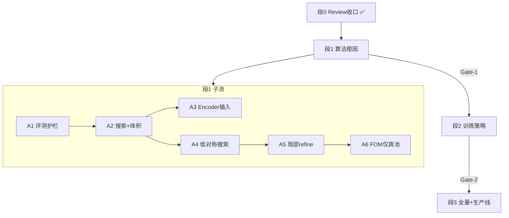

# 2026-07-09 — 完胜 JADE/Mc 引擎攻关方案 v1

> **状态**：段1+段2 **实验收口**（Gate-1/2 未过）；转 raw 精度主线 — 见 [`20260709-段1段2收尾报告.md`](20260709-段1段2收尾报告.md)  
> **方法论**：先算法根因 → 再训练策略 → 最后全量数据；调研 → 方案 → 小步验证 → 生产线  
> **北极星**：MP100 ideal 峰，`ltol=0.05` / `atol=3°` 产品 Top-1 **超过** JADE9 **68.1%**、McMaille **65.9%**  
> **前置依据**：[`20260709-当前问题总览.md`](20260709-当前问题总览.md)、[`20260709-算法现状与理论缺陷分析.md`](20260709-算法现状与理论缺陷分析.md)、[`20260709-Phase3并行排查计划与证据.md`](20260709-Phase3并行排查计划与证据.md)、[`20260708-回归精度提升Phase0-3.md`](../实验记录/20260708-回归精度提升Phase0-3.md)

---

## 0. 执行摘要

当前 NN 在**宽松**容差（0.3/10°）下产品 fom ~86–88%，曾误以为超过 Mc/JADE；在**引擎硬指标**（0.05/3°）下仅 **fom 7–13%**，落后 **55–60pp**。

根因不是 FOM 微调或全量数据不够，而是：

1. **晶胞几何回归太粗**（角 ~18°、边 ~32% 量级误差）
2. **严口径真候选池不够**（topk 16–26%，逐参数更低）
3. **训练/选模尺子偏松**（优化 0.3/10° 而非 0.05/3°）
4. **`find_mapping` 子胞伪命中**会误导扩搜索

本方案按用户确认的两条大原则组织：**先修算法，再修训练，最后 scaling**；每步 **调研 → 写单页方案 → 小步实验 → Gate 过关 → 再进下一段**。

---

## 1. 两条总原则（不可违背）

### 原则 A：层次顺序

```
算法根因（评测/搜索/编码/表示）
    → 训练策略（loss/选模/增强/课程）
        → 数据规模（500k / 全量 608 万）
            → 生产线（固定 config + 门禁 + 回归）
```

**禁止跳层**：在严口径真 topk <40% 时启动全量训练；在评测尺子未统一时大规模 loss sweep。

### 原则 B：工程节奏

```
Review / 调研收口
    → 写「单因素实验方案」（1 页 / 实验）
        → 小步实现 + 评测（尽量 CPU 诊断先行）
            → Gate 判定（过 / 不过）
                → 合并为「训练策略段」或「生产线」
```

**单因素**：每次实验只改一个开关；对照组固定为 baseline ckpt 或上一 Gate 最优。

---

## 2. 北极星与评测尺子

### 2.1 主 KPI（对外 / 上线门禁）

| 数据集 | 容差 | 指标 | 门槛 |
|---|---|---|---|
| MP100 ideal | **ltol=0.05, atol=3°** | **fom_top1**（产品 Top-1） | **> max(JADE 68.1%, Mc 65.9%)** |
| MP100 ideal | 同上 | raw_top1 | 辅报（诊断回归本体） |
| MP100 ideal | 同上 | topk（真池） | 辅报（候选天花板） |

### 2.2 辅 KPI（开发漏斗 / 相对消融）

| 口径 | 用途 |
|---|---|
| **0.3/10°** raw / fom / topk | 历史对比、漏斗、与 Phase0–3 对齐 |
| **逐参数命中** @ 0.05/3° | 剔除 `find_mapping` 子胞伪命中 |
| **体积比** \|log(V_pred/V_truth)\| | 候选池护栏；默认阈值待标定（建议先试 log(2)≈0.69） |
| length_mae / angle_mae / length_mape | 误差分解 |
| per-CS 表 | hex/trig/mono/tric 是否拖后腿 |

### 2.3 必须实现的评测字段（代码债，段 1 首要交付）

在 `eval.py` / `eval_valid.py` / `eval_mp100.py` 统一输出：

| 字段 | 定义 |
|---|---|
| `raw_top1_lattice_match_rate` | pymatgen `find_mapping` |
| `fom_top1_lattice_match_rate` | FOM 重排后 Top-1 |
| `topk_lattice_match_rate` | Oracle Top-K |
| `raw_top1_elementwise_rate` | a,b,c,α,β,γ 逐参数在 ltol/atol 内 |
| `topk_elementwise_rate` | 池中任一候选逐参数命中 |
| `topk_volume_guarded_rate` | 池命中 + 体积比在阈值内 |
| `ltol` / `atol_deg` | 本次评测容差 |

**原则**：任何「扩搜索」实验必须同时报 `find_mapping` 与 `elementwise` 两列。

### 2.4 固定对照 checkpoint（段 1 消融锚点）

```
results/experiments/scale_100k_no_cs_matrix6_seed42/checkpoints/best.pt
```

段 2 起可换为「段 1 最优算法 + 默认训练」checkpoint，但段 1 内保持不变。

---

## 3. 现状数字锚点（2026-07-09）

### 3.1 引擎对照

| 方法 | 0.05/3° Top-1 |
|---|---:|
| JADE9 | **68.1%** |
| McMaille | **65.9%** |
| NN baseline fom | **~9–13%** |
| NN baseline raw | **~3–6%** |

### 3.2 双轨对照（baseline ckpt）

| 设定 | valid raw | valid fom | valid topk | MP100 raw | MP100 fom | MP100 topk |
|---|---:|---:|---:|---:|---:|---:|
| 0.3/10° | 40.9% | 85.9% | 99.1% | 58% | 88% | 100% |
| **0.05/3°** | **6.2%** | **8.6%** | **16.5%** | **3%** | **13%** | **26%** |

### 3.3 Phase 0–3 结论（已完成，不再重复投入）

| 改动 | 宽松 valid raw Δ | 严口径结论 |
|---|---:|---|
| matrix6 | +1.2pp | 小收益，保留 |
| 去 CS 头 | ~0 | 非主因 |
| length_angle loss | +1.5pp（sweep 最优 +5.7pp @46.6%） | 严口径仍崩 |
| cs_mask / reweight / combined | 负 | 无效 |
| FOM v2 微调 | 宽松 +13.8pp | 严口径三 mode 同为 13% |
| 加密尺度 topk | find_mapping 95% | **逐参数仅 4%** → 伪命中 |

---

## 4. 问题清单 → 攻关映射

| 问题 ID | 摘要 | 主攻段 | 实验编号 |
|---|---|---|---|
| P0-1 | 几何回归太粗 | 段 1 + 段 2 | A3–A5, B1–B3 |
| P0-2 | 选模尺子偏松 | 段 1（评测）+ 段 2 | A1, B4 |
| P0-3 | 严口径真池不够 | 段 1 | A2, A4 |
| P0-4 | find_mapping 伪命中 | 段 1 | A1, A2 |
| P1-1 | 低对称失败 | 段 1 + 段 2 | A4, B2 |
| P1-2 | 搜索过窄 | 段 1 | A2, A4 |
| P1-3 | Encoder 2θ 取整 | 段 1 | A3 |
| P1-4 | loss 无 indexing 闭环 | 段 2 | B1–B3 |
| P1-5 | 数据规模 | 段 3 | C1 |
| P1-6 | FOM 在真池上偏弱 | 段 1 末 / 段 2 | A6（Gate 后） |

---

## 5. 总路线图



| 段 | 名称 | 是否占 GPU 重训 | Gate |
|---|---|---|---|
| **0** | Review / 调研收口 | 否 | 问题表 + 尺子规范 |
| **1** | 算法根因 | 少量（A3 等） | 严口径真 topk ≥40% 或逐参数 raw ≥15% |
| **2** | 训练策略 | 是（100k） | 100k 严口径 fom ≥30% 且趋势可复现 |
| **3** | 全量 + 生产线 | 是（500k/全量） | MP100 严口径 fom **>68.1%** |

Gate 阈值可在段 1 中期根据曲线修订，但**不得低于**表中数值进入段 3。

---

## 6. 段 0 — Review / 调研收口（已完成 ✅）

### 6.1 交付物

| 文档 | 内容 |
|---|---|
| [`20260709-算法现状与理论缺陷分析.md`](20260709-算法现状与理论缺陷分析.md) | 代码级缺陷 |
| [`20260709-当前问题总览.md`](20260709-当前问题总览.md) | P0–P2 问题表 |
| [`20260709-Phase3并行排查计划与证据.md`](20260709-Phase3并行排查计划与证据.md) | T1–T7 实验证据 |
| [`20260708-回归精度提升Phase0-3.md`](../实验记录/20260708-回归精度提升Phase0-3.md) | Phase0–3 完整记录 |

### 6.2 段 0 待收尾（进入段 1 前 1–2 天）

- [ ] 将本方案 v1 链接进 `docs/01-design.md` §里程碑
- [ ] 更新 `docs/04-progress.md` 新增 **M4 完胜引擎攻关**
- [x] 实现 A1 评测字段（见 §7.1）

---

## 7. 段 1 — 算法根因（详细实验手册）

> **目标**：在不依赖全量重训的前提下，把**严口径真池**从 ~20% 拉到 **≥40%**，并弄清各算法组件的边际贡献。  
> **默认**：除特别声明外，用 baseline ckpt，只改推理侧或评测侧。

---

### 实验 A1 — 统一严口径 + 逐参数 + 体积护栏评测

**假设**：此前部分「突破」来自伪命中；统一尺子后消融才可信。

**改动**：

| 文件 | 变更 |
|---|---|
| `src/pxrd_cell_indexing/eval.py` | 新增 `lattice_match_elementwise()`、`topk_elementwise_match_rate()`、`volume_ratio()` |
| `scripts/eval_valid.py` | 已有 `--ltol/--atol`；补输出 elementwise / volume_guarded |
| `scripts/eval_mp100.py` | 同上 |
| `scripts/diagnose_strict_tolerance.py`（新建） | 离线：容差曲线、池分解、伪命中率 |

**单因素**：只改评测，不改模型。

**执行**：

```bash
# 双轨 baseline
python scripts/eval_mp100.py --checkpoint results/experiments/scale_100k_no_cs_matrix6_seed42/checkpoints/best.pt \
  --ltol 0.3 --atol-deg 10 --output-path results/beat_engine/a1_mp100_loose.json
python scripts/eval_mp100.py --checkpoint ... --ltol 0.05 --atol-deg 3 \
  --output-path results/beat_engine/a1_mp100_strict.json

python scripts/eval_valid.py --checkpoint ... --ltol 0.05 --atol-deg 3 \
  --output-path results/beat_engine/a1_valid_strict.json
```

**成功标准**：

- 脚本可复现 T1–T7 结论（误差分解、伪命中比例）
- 所有后续实验必须引用 `results/beat_engine/` 下 json

**工时**：1–2 人日（实现 + 跑通）

---

### 实验 A2 — 候选池：尺度变体 + 体积护栏（推理侧）

**假设**：默认 `{2,0.5,√2,√3}` 尺度不足；但无护栏的密尺度会产生伪命中。

**背景数据**：

| 池配置 | find_mapping topk @0.05/3° | 逐参数真命中 |
|---|---:|---:|
| 8 snap only | 12% | — |
| Top-20 无尺度 | 16% | — |
| Top-20 默认尺度 | 26% | ~7% |
| Top-40 密尺度 | 95% | **4%** |

**改动**：

| 文件 | 变更 |
|---|---|
| `src/pxrd_cell_indexing/model/topk.py` | 新增 `TopKConfig.volume_ratio_bounds`；过滤候选 |
| `src/pxrd_cell_indexing/model/topk.py` | 可选扩展 `LENGTH_SCALE_FACTORS`（可配置，不硬编码） |
| `configs/infer/topk_volume_guard.yaml` | 网格：K∈{20,40}，scale 集合，体积比阈值 |

**单因素**：不改 encoder / 训练；同一 raw 预测，只改池构建。

**实验矩阵**（建议顺序执行）：

| 运行 ID | K | 尺度集合 | 体积护栏 \|log r\| ≤ |
|---|---|---|---|
| A2a | 20 | 默认 6 个 | 无 |
| A2b | 20 | 默认 + {3,4,1/3,1/4} | 无 |
| A2c | 20 | 默认 + 扩展 | **log(2)** |
| A2d | 40 | 扩展 | **log(2)** |
| A2e | 40 | 扩展 | **log(1.5)** |

**主指标**：`topk_elementwise_rate` @ 0.05/3°（不是 find_mapping topk）

**成功标准**：

- 较 A2a baseline（~7% 逐参数）**绝对提升 ≥10pp** 且伪命中率 <20%
- 若达不到：证明「仅扩池不够」，必须 A3/A5 提升 raw

**风险**：体积阈值过严会杀掉真子胞；需扫阈值。

**工时**：2–3 人日

---

### 实验 A3 — Encoder 输入：2θ 取整 vs 连续/分箱

**假设**：`bert.py` 中 `pxrd_x.long()` 丢失子度级峰位，是严精度瓶颈之一。

**背景**：0.5° 截断最坏 |ΔQ| ~0.014–0.018 Å⁻¹，而 FOM 默认 q_tol=1e-6。

**改动方案（三选一，分三轮）**：

| 方案 | 实现要点 | 重训 |
|---|---|---|
| A3-i | 2θ×100 取整（0.01° 分辨率） | 需 finetune head+encoder |
| A3-ii | 2θ 线性分箱嵌入（bin=0.05°） | 需 finetune |
| A3-iii | 峰位用 `d` 或 `Q` 代替 2θ 进 position embed | 需 finetune + 数据侧一致 |

**单因素**：每次只试一种编码；loss/Top-K/FOM 不变。

**训练预算**（段 1 内）：100k，**10 epoch** finetune，仅验证趋势（不追求收敛）。

**成功标准**：

- 严口径 **逐参数 raw** 较 baseline **≥+3pp**（MP100 + valid 双验证）
- 或 angle_mae 降 **≥2°** 且边长 MAPE 不恶化 >2pp

**失败则**：A3 降级为 P2，优先 A2/A4/A5。

**工时**：每个方案 3–5 人日（含实现 + 短训 + 评测）

---

### 实验 A4 — 低对称 Bravais / 搜索扩展

**假设**：mono/tric 无专用 snap，identity+jitter 导致 hex/trig 角度拉向 90° 时池内无真解。

**改动**：

| 文件 | 变更 |
|---|---|
| `src/pxrd_cell_indexing/model/bravais.py` | 新增 `monoclinic_P`、`triclinic_P` 等（需晶体学约束表） |
| `src/pxrd_cell_indexing/model/topk.py` | 按事后推断晶系过滤假设（可选） |

**调研先行**（1 人日）：

- 对照 McMaille 假设集合 / `bravais.py` 现有 8 键
- 对照 [`20260708-Bravais原胞约束验证.md`](../实验记录/20260708-Bravais原胞约束验证.md)

**单因素**：只加假设，不改 encoder。

**成功标准**：

- per-CS：hex/trig/mono/tric 的 **逐参数 topk** 任一系 **≥+10pp**
- 整体 `topk_elementwise` **≥+5pp**

**工时**：调研 1 人日 + 实现 2 人日 + 评测 0.5 人日

---

### 实验 A5 — 局部晶胞 refine（推理侧优化）

**假设**：回归点落在「宽松等价类」附近，但不在 0.05/3° 内；小步坐标下降可拉近真解。

**思路**（推理 only，无需重训）：

```
raw_pred → 构建 Top-K 池（A2 最优配置）
         → 对每个候选：在 (a,b,c,α,β,γ) 上有限步梯度下降
            目标 = 峰表 Q 匹配误差（复用 fom 前向）
         → 去重 + FOM 重排
```

**改动**：

| 文件 | 变更 |
|---|---|
| `src/pxrd_cell_indexing/model/refine.py`（新建） | `refine_candidate_by_q_match()` |
| `scripts/eval_mp100.py` | `--refine-steps N` |

**单因素**：在 A2 最优池上叠加 refine；不改训练。

**成功标准**：

- 严口径 fom_top1 **≥+5pp**（相对 A2 最优）
- 且逐参数 topk 不下降

**风险**：过拟合单条谱、体积漂移；需体积护栏。

**工时**：3–5 人日

---

### 实验 A6 — FOM 重排（仅当真池 ≥40% 后）

**前提**：Gate-1 中期检查 `topk_elementwise ≥40%`。

**假设**：真池够大后，当前 heuristic FOM（不用 de Wolff M、默认不用强度）成为瓶颈。

**实验矩阵**：

| 运行 | FOM mode | collapse_variants | n_lines |
|---|---|---|---|
| A6a | heuristic | false | 20 |
| A6b | strict_dewolff | false | 20 |
| A6c | intensity_weighted | false | 20 |
| A6d | heuristic | true | 40 |
| A6e | + 体积 tie-break 修正 | — | — |

**背景**：真解在池内时 FOM 可 100% 选对；当前失败多因池内无真解或假大胞 n_matched 更高。

**成功标准**：

- 严口径 fom_top1 **≥+10pp** 且 topk 不变

**工时**：1–2 人日（mostly 评测）

---

### 段 1 Gate-1（进入段 2 的门槛）

**必须满足其一**：

| 条件 | 阈值 |
|---|---|
| MP100 `topk_elementwise` @ 0.05/3° | **≥40%** |
| MP100 `raw_top1_elementwise` @ 0.05/3° | **≥15%** |
| valid 同指标 | 趋势一致（不得仅 MP100 涨、valid 跌） |

**且**：

- 伪命中（find_mapping 命中但 elementwise 不命中）占 topk 比例 **<30%**
- 实验记录完整：每个 A* 一行结果写入 [`docs/实验记录/`](../实验记录/)

**未过关**：禁止进入段 2 大规模 loss 改造；继续段 1 或修订方案 v2。

---

## 8. 段 2 — 训练策略对齐

> **前提**：Gate-1 通过。  
> **目标**：在 **100k** 上让严口径 fom **≥30%**，且较段 1 推理侧最优有 **≥+10pp** 增益，证明「训练能放大算法收益」。

### 8.1 原则

1. **选模尺子改为严口径**（或 composite：0.5×strict_fom + 0.5×strict_elementwise_raw）
2. **监控双轨**：TensorBoard / valid 日志必含 loose + strict
3. **仍单因素**：一次只改 loss 或 schedule 或 augment 之一

### 8.2 实验 B1 — 严口径对齐的损失

**候选**（按优先级）：

| ID | 损失思路 | 说明 |
|---|---|---|
| B1a | 逐参数 hinge @ 0.05/3° | 边长/角度超过阈值才罚 |
| B1b | 分晶系 angle 加权 | hex/trig γ,α 加权 3–5× |
| B1c | 峰 Q 匹配可微近似 | 小 batch 上辅助项 |
| B1d | 等价类不变性（难） | 同一晶格不同 6 参数描述 |

**实现**：`losses.py` 新 mode；`configs/beat_engine/loss_*.yaml`

**成功标准**（100k，20 epoch 内）：

- 严口径 fom **≥30%**
- 较「段 1 最优推理 + 旧 ckpt」**≥+10pp**

### 8.3 实验 B2 — 低对称课程 / 采样

| ID | 做法 |
|---|---|
| B2a | train 过采样 hex/trig（2×） |
| B2b | valid 早停看 **per-CS 严口径** 而非全局 |
| B2c | 两阶段：先 cubic+tet+orth 5 epoch，再全晶系 |

### 8.4 实验 B3 — 增强与严精度

**假设**：`augment_spectrum` 的 2θ shift ±0.1°、强度缩放与严几何冲突。

| ID | 做法 |
|---|---|
| B3a | 关闭 2θ shift |
| B3b | 减小 shift 至 ±0.02° |
| B3c | 仅强度噪声，不动峰位 |

### 8.5 实验 B4 — 选模与 early-stop

| 字段 | 现值 | 目标值 |
|---|---|---|
| `best_metric` | `top1_lattice_match_rate` @ 默认 0.3/10 | `strict_fom_top1` 或 composite |
| `eval_every` | 1 | 保持 |
| Trainer valid | 无 strict | 每 epoch 算 strict（可子集 200 条加速） |

**改动**：`trainer.py`、`training/config.py`

### 8.6 段 2 Gate-2（进入段 3）

| 条件 | 阈值 |
|---|---|
| valid 严口径 fom | **≥30%** |
| MP100 严口径 fom | **≥35%** |
| 较 baseline 严口径 | **≥+20pp** |
| Phase3 宽松 raw | 参考；**不以宽松为 Gate** |

---

## 9. 段 3 — 全量数据与生产线

> **前提**：Gate-2 通过。

### 9.1 数据 scaling

| 阶段 | 规模 | 目的 |
|---|---|---|
| C1a | 500k | 验证 scaling 在严口径下仍有效 |
| C1b | 全量 ~608 万 | 冲北极星 |

**决策门 D-scaling**（沿用 D29 精神）：若 500k 严口径 **<+5pp** vs 100k，暂停全量，回段 1/2 修算法。

### 9.2 固定生产 config

产出：

```
configs/production/beat_engine_v1.yaml   # 锁死：模型/loss/topk/fom/评测容差
scripts/production/eval_gate.sh          # 一键 MP100+valid+test 严口径
```

### 9.3 上线门禁（生产线）

| 检查项 | 要求 |
|---|---|
| MP100 @ 0.05/3° fom_top1 | **>68.1%** |
| MP100 逐参数 fom_top1 | 辅报，应接近 find_mapping 值 |
| test1400 严口径 | 不得比 valid 低 >5pp（过拟合） |
| 对照 JADE/Mc | 同 CIF、同峰模拟口径文档化 |
| pytest | 全绿 |
| 可复现 | seed、config、ckpt、结果 json 归档 |

### 9.4 非目标（段 3 仍不做，除非单独立项）

- 实测谱 / deploy 峰提取对齐
- 多卡 DDP（IO 仍瓶颈时收益有限）
- With-L 全结构生成

---

## 10. 实验管理规范

### 10.1 每个实验的文档模板

路径：`docs/实验记录/YYYYMMDD-<实验ID>-<简述>.md`

```markdown
# 实验 <ID> — <标题>

## 假设
## 单因素（改什么 / 不改什么）
## 配置与命令
## 结果（双轨 + 逐参数）
## 结论（支持/否定假设）
## 下一步
```

### 10.2 结果文件命名

```
results/beat_engine/<实验ID>_<数据集>_<ltol>_<atol>.json
```

### 10.3 分支策略

- 段 1 推理侧改动：`feat/beat-engine-a1-eval` 等，可合并快
- 段 2 训练改动：每个 B* 独立分支或独立 `experiment_name`，便于对比 `results/experiments/`

### 10.4 资源约定

| 资源 | 段 1 | 段 2 | 段 3 |
|---|---|---|---|
| GPU | 短 finetune（A3）| 100k 满 epoch | 500k/全量 |
| CPU | 诊断优先 | — | — |
| 人力 | 1 人主线 + 评审 | 同左 | 同左 |

---

## 11. 风险登记册

| 风险 | 影响 | 缓解 |
|---|---|---|
| 逐参数指标过严，与引擎 find_mapping 不可比 | 与 JADE 口径不一致 | 主 Gate 仍用 find_mapping；逐参数作辅护栏 |
| A3 需重训，与 Phase3 sweep 抢卡 | 延期 | A1/A2 CPU 先行；A3 排队 |
| 体积护栏阈值难标 | 误杀真子胞 | 扫 log(1.5)~log(3) |
| mono/tric snap 晶体学错误 | 引入新 bug | 对照 Bravais 验证脚本 |
| 全量训练掩盖算法缺陷 | 浪费算力 | Gate-1/2 强制 |
| 宽松指标回弹诱惑 | 战略摇摆 | 文档写明「宽松仅漏斗」 |

---

## 12. 明确不做清单（至 Gate-2 前）

- ❌ 全量 608 万训练
- ❌ 仅调 FOM 指望 13%→68%
- ❌ 无体积护栏的密尺度 topk 优化
- ❌ 宽松 0.3/10° 选 best ckpt
- ❌ 重复 Phase2 loss 消融（length_angle/cs_* 已充分）
- ❌ 再争论分类头 / matrix9

---

## 13. 建议时间线（粗估，可并行）

| 周 | 工作 |
|---|---|
| W1 | A1 评测护栏 + A2 池/体积（CPU 为主） |
| W2 | A2 扫完 + A4 调研/实现；A3-i 启动短训 |
| W3 | A3 结果 + A5 refine；中期 Gate-1 检查 |
| W4 | A6（若过关）+ B4 选模改严口径 |
| W5–6 | B1–B3 100k 实验 |
| W7 | Gate-2；若过，启动 500k |
| W8+ | 全量 + 生产线 + 北极星验收 |

---

## 14. 与现有里程碑关系

| 原里程碑 | 本方案 |
|---|---|
| M2.6 Phase0–3 | ✅ 收尾；结论并入本方案 §3.3 |
| M3 MP100 | 🔄 重定义为 **严口径** M3；宽松 M3 降为漏斗参考 |
| **M4（新）** | 完胜引擎攻关：段 0–3 |

建议在 `04-progress.md` 增加：

```
| M4 | 完胜 JADE/Mc @ 0.05/3° | 🟡 | 攻关方案 v1 已发布；段 1 启动 |
```

---

## 15. 附录 A — 代码模块与实验映射

| 模块 | 路径 | 相关实验 |
|---|---|---|
| 评测 | `eval.py`, `eval_*.py` | A1 |
| Top-K | `model/topk.py` | A2, A4 |
| Bravais | `model/bravais.py` | A4 |
| Encoder | `model/encoder/bert.py` | A3 |
| Refine | `model/refine.py`（待建） | A5 |
| FOM | `model/fom.py` | A6 |
| Loss | `losses.py` | B1 |
| Trainer | `training/trainer.py` | B4 |
| Dataset | `data/dataset.py` | B2, B3 |

---

## 16. 附录 B — 文献与内部参考

| 主题 | 参考 |
|---|---|
| 晶系条件化回归 | Chitturi et al., J. Appl. Cryst. 2021 |
| Top-K 训练 | Multiple Choice Learning; Annealed MCL |
| RealPXRD 编码 | Nat. Commun. 2025; `docs/开发日志/20260707-RealPXRD-Solver深度调研.md` |
| McMaille 对照 | `docs/开发日志/起点.md` |
| Bravais 约束 | `docs/实验记录/20260708-Bravais原胞约束验证.md` |
| 架构原则 | `docs/开发日志/深度学习任务架构原则.md` |

---

## 17. 附录 C — 段 1 启动检查清单（本周）

- [ ] 评审本方案 v1（PM / 主程）
- [x] 创建 `results/beat_engine/` 目录
- [x] 实现 A1：`elementwise` + `volume_guarded` 指标
- [x] 跑通 A1 baseline 四份 json（MP100/valid × loose/strict）
- [x] 启动 A2a–e（MP100 严口径 sweep；**未达 +10pp**，见实验记录）
- [x] 实验记录：`20260709-A1-严口径评测护栏.md`（完成后）
- [x] 实验记录：`20260709-A2-候选池尺度与体积护栏.md`
- [x] 实验记录：`20260709-A5-推理侧Qmatch局部refine.md`
- [x] 实验记录：`20260709-A3-连续2θ位置编码短训.md`
- [x] 实验记录：`20260709-A4-低对称Bravais扩展.md`
- [x] 段 1 Gate-1 未过 → 启动段 2：**B4 严口径选模**（✅ 小幅 +2pp；见实验记录）
- [x] **B1** 严口径对齐 loss（B1a 负向 / B1b 崩塌）→ [`20260709-B1-严口径对齐损失.md`](../实验记录/20260709-B1-严口径对齐损失.md)
- [x] **B3a** 关 2θ shift（✅ +1pp；MP100 fom 14%）→ [`20260709-B3-减弱2θ增强.md`](../实验记录/20260709-B3-减弱2θ增强.md)
- [x] **B2a** 低对称 ×2（略负）→ [`20260709-B2-低对称过采样.md`](../实验记录/20260709-B2-低对称过采样.md)
- [x] 段1+段2 收尾报告 → [`20260709-段1段2收尾报告.md`](20260709-段1段2收尾报告.md)
- [x] **R0** raw 误差分解 → [`20260710-Raw精度根因诊断R0.md`](20260710-Raw精度根因诊断R0.md)（非立方 0.17%；pull→90° 75%）
- [ ] **下一步 R1**：打正交先验 / 非立方角度 + 边长（条件化或相加式监督）；scaling 须盯非立方曲线
- [x] A5 refine（**未达 +5pp**）→ [`20260709-A5-推理侧Qmatch局部refine.md`](../实验记录/20260709-A5-推理侧Qmatch局部refine.md)
- [x] A3 continuous 2θ（**严口径变差**）→ [`20260709-A3-连续2θ位置编码短训.md`](../实验记录/20260709-A3-连续2θ位置编码短训.md)
- [x] A4 低对称 Bravais（持平/略降）→ [`20260709-A4-低对称Bravais扩展.md`](../实验记录/20260709-A4-低对称Bravais扩展.md)

---

**文档版本**：v1.1（段1+段2 收口）  
**下次修订触发**：raw 精度段 R0/R1 方案落地，或新 ckpt 刷新 Gate 数字
