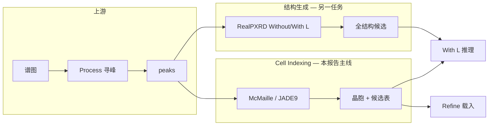

# 195 - 综合报告：Cell Indexing 全历程 — 从设计到 JADE9 / Mc / RealPXRD

- **日期**：2026-07-06
- **受众**：项目内复盘 / 对外专家一页扩展版
- **范围**：2026-05～06 Cell Indexing 产品设计与 MP100 benchmark → 三引擎对照 → 192 论文口径 Without L → 当前遗留问题
- **关联文档**：112、174、179、186、188、192、194；代码根 `RealPXRD-APP-开发测试/`

---

## 0. 执行摘要

| 维度 | 结论 |
| --- | --- |
| **产品定位** | Cell Indexing = 峰表 → 晶胞六参数 + 可靠性；下游接 **With L 推理 / Refine / S&M** |
| **主引擎** | **McMaille**（2026-06-24 竞技选定）；App 已固定 McMaille 路径，去除 GSAS/native 排序壳 |
| **专用 indexing 能力** | MP100 ideal 峰上 **Mc ~76%**、**JADE9 ~73%** lattice match（ltol=0.3, atol=10°） |
| **RealPXRD Without L** | **不能**替代 indexing：lattice match **5～16%**（任务错配 + 扩散召回不足） |
| **论文口径 SM** | 修正 primitive + `truth.formula` 后 Top-20 SM **81%**（≈ CNRS 79.4%）；初跑 23% 主要是 **benchmark 喂参错误** |
| **最大遗留** | 实测谱与 ideal 差距、大结构（>40 原子）弱、Top-1 排序口径混用、manifest 约化式误用风险 |

---

## 1. 我们到底在做什么

### 1.1 Cell Indexing 在产品里的含义

**输入**：预处理主峰表 `[[2θ, I], …]`（+ 波长；Formula 不参与 Mc 搜索）  
**输出**：晶胞 `(a,b,c,α,β,γ)`、M20/M20*、可靠性 Grade、空间群提示  
**成功（benchmark）**：与 CIF truth 在几何意义下等价（体积/晶系或 `find_mapping`）

**关键区分**：JADE9 / McMaille 做 **cell indexing（搜晶格）**；RealPXRD 做 **de novo 结构生成（原子+晶格联合采样）**。混在同一指标表里会严重误导。

### 1.2 两条 benchmark 线

| 线 | 任务 | 主指标 | 代表文档 |
| --- | --- | --- | --- |
| **A. Indexing 线** | 峰 → 晶格 | recall / lattice match / strict Top-1 | 174、179、186 |
| **B. 生成线** | 化学式+峰 → 全结构 | StructureMatcher / lattice match @ N 候选 | 188、192 |

---

## 2. 时间线：从设计到现在

### 2.1 阶段 0 — 产品骨架（2026-05～06 上旬）

| 工作 | 内容 |
| --- | --- |
| **68** | Infer 页「Run Indexing」→ 填 Lattice → 切 With L |
| **90～91** | 纯 XRD native 多晶系搜索引擎 + M20 可靠性 |
| **92～93** | GSAS-II `DoIndexPeaks` 接入（A 路线） |
| **局限** | 初版仅 cubic/hex 等部分晶系；Formula 曾参与搜索（后改为不参与） |

**产物**：`app/xrd/indexing.py`、`app/xrd/index_engine.py`、`webapp_v2/modules/infer/`

### 2.2 阶段 1 — MP100 Tier-0 与引擎竞技（2026-06-22～24）

| 工作 | 内容 |
| --- | --- |
| **125～126** | MP100 数据集（100 条分层 CIF）+ Tier-0 指标体系 |
| **131～132** | 引擎全景调研 + **同台竞技**（native / gsas2 / mlindex / dicvol / **mcmaille**） |
| **145** | 决策：**McMaille 为唯一主索引器**；GSAS indexing 98% timeout 归档 |

**竞技结果（ideal 棒谱，strict Top-1）**：

| 引擎 | strict Top-1 | 备注 |
| --- | ---: | --- |
| **mcmaille** | **46.9%** | 中位 2.2s，19 timeout |
| mlindex | 25.0% | 慢 |
| dicvol | 20.0% | **80% timeout** |
| gsas2 | — | **98% timeout** |
| oracle（并集） | 56% | 多引擎上界 |

**脚本**：`scripts/benchmarks/mp100_compete.py`、`mp100_mcmaille_rerun.py`

### 2.3 阶段 2 — McMaille 专项优化（2026-06-26～07-01）

| 工作 | 内容 |
| --- | --- |
| **139** | Recall 诊断：主瓶颈 **真解未入池**（喂峰过严、缺超胞），非加深 max_candidates |
| **157** | 0.1% 弱峰 + 60 峰 + **supercell/subcell 扩池**；recall **53→63/100** |
| **168** | 理想谱审计：CIF 无系统性错；默认 min_rel **0.001** |
| **171～173** | 双口径 recall、输入 Grade/拒答、DICVOL smoke（未产品化） |
| **App** | Infer 隐藏 Mc 参数，固定 `60 峰 / 600s / 30 候选` |

**McMaille 代码能力（非 GSAS 壳）**：

- `_mcmaille_subcell_candidates`、`_hex_sqrt3_subcell_candidates`、`_mcmaille_supercell_candidates`
- metric **M20*** 排序 + reliability 展示（2026-07-06 去除 `_prefer_compact_cell` / composite_search_score 混排）

**综合文档**：`174-综合报告-CellIndexing优化全过程-2026-07-01.md`

### 2.4 阶段 3 — 三引擎 lattice 对照（2026-07-02～03）

**问题**：Mc 优化后，和 **JADE9**、**RealPXRD Without L** 在同一 lattice 指标下差多少？

| 引擎 | n 有效 | lattice match @ 0.3/10° | 输入 |
| --- | ---: | ---: | --- |
| **McMaille** | 89 | **76.4%** | ideal sticks + App adapter |
| **JADE9** | 91 | **72.5%** | ideal → JADE 导出 `.hkl` |
| **RealPXRD Without L** | 100 | **5.0%** | `structures[0]`，ideal 峰 |

**181 喂峰 ablation**（RealPXRD）：换 deploy_peaks 等仍 **≤13%** Peak-FOM Top-1  
**188 全实验**：oracle N=50 上限 **16%** → **84% 样本 50 候选内无真晶格**（扩散召回瓶颈）

**研判（186）**：

- Without L **不能**承担 cell indexing
- 训练端到端 indexing NN **证据不足**；可行 ML 点在 **Mc 候选池内轻量重排**
- 产品：**Mc 主 + JADE 备**；RealPXRD 用于 **With L 结构生成**，不作 indexing 主引擎

**文档**：`179`、`181`、`182`、`185`、`186`、`188`

### 2.5 阶段 4 — 论文口径 Without L 结构评估（2026-07-06）

**问题**：RealPXRD Without L 在 **尽量贴论文** 流程下，MP100 上 StructureMatcher 如何？

| 轮次 | 问题 | SM Top-1 / Top-20 |
| --- | --- | --- |
| 初跑 | conventional truth + manifest formula | 23% / 32% |
| + primitive truth | Lattice 口径修正 | 23% / 31% |
| **+ truth.formula** | **67/100 原子数喂错** | **41% / 81%** |

**最终（192 + 194）**：

- Top-20 SM **81%** ≈ 论文 CNRS **79.4%**（合成谱，非严格复现）
- Top-1 SM **41%** < 论文 52.4%（Rp 排序 vs oracle min-RMS）
- Lattice Top-20 **97%**（同批内联；说明生成能出可映射晶格，初跑低是口径问题）

**必读**：`194-报告-MP100推理Formula与Truth口径-必读-2026-07-06.md`

### 2.6 阶段 5 — App 前端 McMaille 收口（2026-07-06）

| 改动 | 说明 |
| --- | --- |
| `index_peaks_mcmaille` | 独立 `_finalize_mcmaille_results`：M20* 排序，无 GSAS/native rerank |
| Infer UI | 固定 McMaille；去掉 ranking_mode / GSAS 壳选项 |
| 测试 | `test_mcmaille_*.py` 18 passed |

---

## 3. 我们做了哪些工作（按类型）

### 3.1 产品与引擎代码

| 模块 | 路径 | 作用 |
| --- | --- | --- |
| Index 核心 | `app/xrd/index_engine.py` | Mc/GSAS/native 分发；Mc 子胞/超胞；Mc finalize |
| Native 定胞 | `app/xrd/indexing.py` | 高对称晶系纯 XRD（benchmark/归档） |
| Mc 外部引擎 | `app/xrd/external_engines/mcmaille.py` | 子进程 McMaille |
| Infer 页 | `webapp_v2/modules/infer/` | Run Indexing、候选表、With L 联动 |
| 结构推理 | `webapp_v2/inference/runner.py` | Without/With L，`formula → num_atoms` |

### 3.2 Benchmark 与数据

| 资产 | 说明 |
| --- | --- |
| **MP100** | `refine_benchmarks/mp100/` — 100 条分层 CIF + manifest |
| **竞技** | `mp100_compete*.json` — 多引擎 Tier-0 |
| **Mc 重跑** | `mp100_mcmaille_rerun_*.json` — recall 优化轨迹 |
| **三引擎** | `mp100_three_engine_lattice_compare_20260702.json` |
| **RealPXRD lattice** | `mp100_realpxrd_lattice_bench_*.json`、feed ablation |
| **论文 SM** | `mp100_structure_match_without_L_paper_primitive_formula_fix_full100_20260706.json` |

### 3.3 指标体系统一

| 场景 | 常用指标 | 容差 |
| --- | --- | --- |
| Mc Tier-0 | strict recall、strict Top-1、lattice_match | V 8%/5%；find_mapping 0.05/3° |
| 三引擎 lattice | lattice match rate | **ltol=0.3, atol=10°** |
| 论文 SM | Top-1/Top-20 StructureMatcher | stol=0.5, ltol=0.3, atol=10° |

**注意**：不同报告容差/分母不同，**不可直接横比数字**而不读表头。

---

## 4. 三引擎对照：一张总表

**条件**：MP100，ideal 或 deploy 变体见各报告；lattice 主指标 lt ol=0.3/10°（179 基线）

|  | **JADE9** | **McMaille** | **RealPXRD Without L** |
| --- | --- | --- | --- |
| **任务** | 专用 powder indexing | 专用 powder indexing | 生成式结构预测 |
| **Top-1 lattice** | ~72.5% | ~**76.4%** | **5～13%**（喂峰/排名变体） |
| **Top-20 / oracle** | — | recall 池 ~72% | SM oracle ~81%（**修正 formula 后**） |
| **失败形态** | 无 .hkl（9/100） | timeout/nosol（11/100） | **100% 有结构但晶格常错** |
| **晶系特点** | Tet/Ortho 强；Cubic 弱 | Cubic/Mono/Ortho 强；Tet/Trig 弱 | 除少数小胞外普遍差 |
| **App 角色** | 备援 / 对照 | **默认 Run Indexing** | Infer Without L（非 indexing） |

**产品结论（179/186）**：Indexing 用 **Mc（主）+ JADE（备）**；RealPXRD 走 **Mc 指标化 → With L 生成** 的产品路径，不要用 Without L 当指标化引擎。

---

## 5. 目前还存在什么问题

### 5.1 Benchmark 与口径（高优先级 — 已部分固化于 194）

| 问题 | 影响 | 状态 |
| --- | --- | --- |
| **manifest 约化式 ≠ primitive truth.formula** | 推理 `num_atoms` 错 → SM 全灭 | ✅ bench 已改；⚠️ manifest 未刷新；App 用户 Formula 仍可能错 |
| **conventional vs primitive truth** | Lattice 被倍胞系统性压低 | ✅ 192 已改 primitive |
| **Top-1 定义混用** | Rp vs min-RMS vs FOM Top-1 不可横比 | ⚠️ 报告须分栏注明 |
| **ideal 峰 vs 实测谱** | Mc 76% 是 indexing 上界；deploy 更低 | ⚠️ 181 ablation 仅部分覆盖 |

### 5.2 McMaille / Indexing 能力边界

| 问题 | 数据/说明 |
| --- | --- |
| **~25 条 recall_fail** | 157 后仍约 25/100 真胞未入池（F3/F4 搜索边界） |
| **ranking_fail** | 真胞入池但非 Top-1（~10 条）；轻量判别器重排仅 +8 条量级（175/186） |
| **低对称 / 大胞** | Mono/Ortho 弱于 Cubic；timeout 仍有个别 |
| **实测谱未对齐** | App Process 峰与 ideal 阈值差异；Mc 生产表现需单独 benchmark |
| **DICVOL / GSAS index** | smoke 有救个别样本，timeout 过高，**未产品化** |

### 5.3 RealPXRD Without L

| 问题 | 说明 |
| --- | --- |
| **Indexing 任务错配** | lattice match 5～16% vs Mc 76%（188） |
| **扩散召回** | 84% 样本 N=50 内无真晶格（188） |
| **大结构** | nsites >40：SM Top-20 **~27%**（192 修正后） |
| **Top-1 SM** | 41% vs 论文 52.4%：Rp 排序 + 非 CNRS 数据 |
| **With L 未纳入主表** | Mc 晶格条件生成质量需单独 benchmark（179 Out-of-Scope） |

### 5.4 产品与工程

| 问题 | 说明 |
| --- | --- |
| **Infer Formula 与 truth 无自动对齐** | 用户常输入约化式；与 192 论文口径不一致 |
| **Indexing 与 Infer 任务 UI 相邻** | 易误以为 Without L 可替代 Run Indexing |
| **S&M / Refine 联动** | index hint 依赖指标化质量；Mc 失败时下游无晶胞 |
| **多引擎维护成本** | GSAS/native 壳已归档但代码仍在；需防回归混用 |

### 5.5 训练 / ML 路线（186 研判）

| 命题 | 结论 |
| --- | --- |
| 训练替代 Mc 的端到端 indexing 模型 | **证据不足**；Mc/JADE 已在 ideal 上 73～76% |
| 最可行 ML 点 | Mc **候选池内**轻量判别器重排（+8 条量级） |
| RealPXRD 训练重心 | **结构生成 / With L**，非 lattice-only indexing |

---

## 6. 建议的后续优先级

| 优先级 | 动作 |
| --- | --- |
| **P0** | 凡 RealPXRD benchmark：**primitive + truth.formula**（见 194）；禁止 manifest formula 喂模型 |
| **P0** | 产品默认：**McMaille indexing**；Without L 标注为「结构探索」 |
| **P1** | **deploy 实测谱**上 Mc vs JADE 复测（ideal 76% 不能代表 Process 峰） |
| **P1** | **With L** benchmark（Mc 晶格 → 生成 → SM），与 indexing 表分开 |
| **P2** | Mc 剩余 recall_fail 样本分桶（F3/F4）；评估是否 worth DICVOL 路由 |
| **P2** | Top-1 统一报告：**oracle min-RMS** 与 **Rp** 分列，便于对论文 Table |
| **P3** | manifest 增 `primitive_formula` / `primitive_nsites` 字段，防误用 |

---

## 7. 文档与脚本索引（按主题）

| 主题 | 文档 |
| --- | --- |
| 产品/UI 总览 | 112、68 |
| 竞技与 Mc 选型 | 131、132、145、174 |
| 三引擎 lattice | **179**、177 |
| RealPXRD 喂峰/排名 | 181、182、185、**188**、187 |
| 训练可行性 | **186** |
| 论文 SM + 口径 | **192**、**194** |
| Mc App 收口 | 本轮 index_engine + infer handlers 改动 |
| 指标指南 | 125 |

| 脚本 | 用途 |
| --- | --- |
| `mp100_compete.py` | 多引擎竞技 |
| `mp100_mcmaille_rerun.py` | Mc 全量重跑 |
| `mp100_three_engine_lattice_compare.py` | JADE/Mc/RealPXRD lattice |
| `mp100_realpxrd_lattice_bench.py` | RealPXRD Without L lattice |
| `paper_infer/mp100_structure_match_bench.py` | 论文口径 SM |

---

## 8. 一句话总结

我们从 **Infer 页 native/GSAS 教学级指标化** 出发，经 **MP100 竞技选定 McMaille** 并做到 **~63/100 strict recall / ~76% lattice match（ideal）**；与 **JADE9（~73%）** 对照确认 **专用 indexing 引擎有效且互补**；**RealPXRD Without L 不能替代 indexing（~5～16% lattice）**，但在 **修正 truth.formula 与 primitive 口径** 后 **StructureMatcher Top-20 可达 81%**，说明 **生成模型可用、benchmark 口径曾严重低估**。当前主要风险是 **约化式/ primitive / Top-1 定义混用** 以及 **ideal 峰与实测谱、大结构、With L 路径** 仍未完全覆盖。
